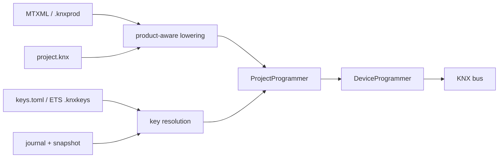

# Programming Real Devices

The host tools commission BCU1, BCU2, System 7, and System B devices from a
human-editable project. Product structure still comes from MTXML/`.knxprod`
and mask procedures still come from `knx_master.xml`; the project supplies the
installation-specific identity, parameters, object flags, group memberships,
and security policy.



The project layer is host-only. It does not add code or data to either embedded
stack.

> Hardware coverage includes BCU1, plain and secure BCU2, and plain and secure
> micro System 7 targets. The micro System 7 secure light switch has also been
> exercised on hardware. System B and the full System 7 paths have software-DUT
> coverage; qualify each connector/product combination before deploying it.

## Project directory

```text
bench/
├── project.knx
├── keys.toml
└── .zweidraehte/
    ├── snapshot.json
    ├── journal.jsonl
    └── project.lock
```

- `project.knx` is authored desired state. Product paths are relative to it.
- `keys.toml` is the authoritative plaintext credential store. Keep it out of
  source control when appropriate.
- `.zweidraehte/` is machine-written mutable state. Do not edit or merge it.
  A lock is held for the entire mutable bus session.

Opening, checking, and dry-running a project do not create keys or state. Use
`knx-loader init`, or save a product-only draft in `knxproj-tui`, to initialize
both with the same random `state_id`. A mismatch or missing mutable state
blocks secure group sending until explicit recovery.

## Project language

This is intentionally a small subset of the future project DSL:

```knx
ga kitchen_switch = 1/0/1
ga all_off = 0/0/1

net kitchen_switch : 1.001 {
    name "Kitchen switch"
    security authentication_confidentiality
}

net all_off : 1.001 {
    name "All off"
    security automatic
}

area 1 bench {
    line 1 main {
        medium tp1

        device button {
            product local:"products/button.mtxml"
            language "de-DE"
            address 1.1.10
            serial "00FA:00000001"
            data_secure enabled

            param "M-00FA_A-0001_P-1" = 3

            object 0 {
                on kitchen_switch
                flags {
                    communication true
                    transmit true
                }
            }
        }

        device relay {
            product local:"products/relay.mtxml"
            address 1.1.20
            data_secure enabled

            object 0 {
                on kitchen_switch
                also on all_off
                flags {
                    communication true
                    write true
                    update true
                    priority low
                }
            }
        }
    }
}

external_sender visualisation {
    address 1.1.250
    data_secure enabled
    on kitchen_switch
}
```

`max_apdu` is an optional safety cap, not a declaration of device
capability. The programmer reads `PID_MAX_APDU_LENGTH` when the target has
properties and the local interface supports extended frames; a missing or
invalid property selects the standard-frame value 15. Secure management also
reserves the S-A_Data envelope inside that detected wire limit. Specify, for
example, `max_apdu 32` only to force smaller chunks for a problematic target.

`language` is an optional per-device product-editor preference. It changes
only the translated labels shown by `knxproj-tui`; it does not change the
compiled device configuration or make a device stale. Selecting a language
with `l`/`L` updates the in-memory project draft, and the normal `e` save
command persists it. Selecting the product's default language removes the
declaration.

`name` is an optional display label for a net. The identifier stays stable
because it also identifies memberships, group keys, SIAT dependencies, and
deployment state. In `knxproj-tui`, select a group address in the project pane
and press `r` to edit the label.

`on` is the sole primary/sending association. `also on` adds listening
associations. Flags belong to the communication object, not an association,
and layer over product defaults and visible `ComObjectRef` overrides. Each
field is optional: `communication`, `read`, `write`, `transmit`, `update`,
`read_on_init`, and `priority`.

An object with memberships needs exactly one primary. Effective `T`, `R`, or
`I` without one is rejected. `I` without `U`, and traffic flags with `C =
false`, are warnings. All memberships of one object must resolve to one Data
Secure protection mode because PID 61 is per object. Net DPTs are checked
against the effective product DPT and payload width.

Security policies are `plain`, `automatic`, `authentication`, and
`authentication_confidentiality`. `automatic` becomes authentication plus
confidentiality when a group key resolves; otherwise it remains plain.

Data Secure capability and enablement are separate. The referenced product's
MTXML `IsSecureEnabled` attribute says whether the application supports Data
Secure; the device's `data_secure enabled|disabled` declaration says whether
this project enables it. Omission defaults to `disabled`. Enabling it for an
unsupported product is an error. Linking a disabled device to an explicitly
secured net is rejected during project validation; an `automatic` net is
rechecked after key resolution and is rejected if a resolved key would make
it secure. Primary and additional memberships are treated identically.

An unmanaged `external_sender` has no product file to inspect, so
`data_secure enabled` is the operator's assertion that it supports and uses
Data Secure. A disabled external sender is likewise rejected from a secured
net. One communication object still cannot mix plain and protected nets.

## Keys

`keys.toml` separates per-device credentials from group keys and epochs:

```toml
version = 1
state_id = "generated-project-state-id"

[device.button.fdsk]
kind = "fdsk"
encoding = "knx_fdsk"
value = "AD5N5L-N654AA-CAQDAQ-CQMBYI-BEFAWD-ANBYHX"
origin = "device_label"

[device.button.tool_key]
kind = "tool_key"
encoding = "hex"
value = "00112233445566778899AABBCCDDEEFF"
origin = "generated"

[group.kitchen_switch]
active_epoch = 1

[group.kitchen_switch.epochs.1]
kind = "group_key"
encoding = "hex"
value = "102132435465768798A9BACBDCEDFE0F"
state = "active"
origin = "manual"
```

FDSKs accept 32 hexadecimal digits or a CRC-checked KNX label. Labels also
carry a serial number; disagreement with `project.knx` or an ETS keyring is an
error. Tool and group keys contain 32 hexadecimal digits. Equal project and
keyring values merge; conflicts fail before bus access. Merely supplying a
keyring never copies its secrets into `keys.toml`; `import-keyring` is the
explicit operation for making matching device and group credentials part of
the authoritative project store.

`knx-loader add --fdsk ...` accepts either spelling;
`--device-certificate ...` is its descriptive alias. A certificate supplies
the device serial automatically. Supplying `--serial` as well is allowed only
when both values agree.

If a device has only an FDSK, programming generates and atomically persists a
random tool key before opening the bus. A retry therefore tries the same tool
key first even if the first acknowledgement was lost. Group keys are never
generated implicitly. Changing an already deployed active group key is
rejected until a rotation workflow exists.

Use `--keyring FILE` with `--keyring-password` or
`KNX_KEYRING_PASSWORD` to merge a read-only ETS `.knxkeys` export.
To stop depending on that external file, import the entries which match
project devices by serial and project nets by group address:

```bash
knx-loader --project project.knx --keyring project.knxkeys \
  --keyring-password "$KNX_KEYRING_PASSWORD" import-keyring
```

The import also advances managed-device and declared external-sender sequence
observations from the ETS export. It does not import an ETS client sending
counter, because a device `SequenceNumber` is that device's last observed
outgoing value.

The reverse operation exports the active key epoch for every project net,
device tool keys, FDSK/serial certificate components, and last-valid device or
external-sender sequence observations. The password option may be replaced by
`KNX_KEYRING_PASSWORD`. Existing output files are never overwritten:

```bash
knx-loader --project project.knx \
  --keyring-password "$KNX_KEYRING_PASSWORD" \
  export-keyring --out project-export.knxkeys
```

The project client's own `client_next` is not exported because `.knxkeys` has
no field for it; it remains authoritative in `.zweidraehte/snapshot.json`.
Historical/retired group-key epochs likewise remain in `keys.toml`, while the
single active epoch representable by ETS is exported.

## Sequence numbers and SIAT

Application Layer §5.3.1 gives the client one outgoing sequence counter for
secure management and group communication. Its successor is appended and
fsynced before a protected frame is handed to the transport layer. Authenticated
incoming floors are persisted before plaintext delivery. Imports and sync may
only move floors forward.

A commissioned Tool-Key session uses those persisted counters directly. Its
first authenticated response proves the stored state; an unanswered request
falls back to one point-to-point S-A_Sync and retry. Missing state and FDSK
factory/recovery access synchronize before their first management traffic. An
FDSK credential proven by sync may be reused by later connections in the same
bus session, but persisted FDSK counters alone are never trusted after process
restart. `knx-loader sync` and `recover-state` force synchronization even when
stored counters look usable. A `T_ACK` alone proves transport delivery, not
secure acceptance, so a no-response mutation is never used as the optimistic
probe.

Batch preflight applies this decision independently per device. It neither
synchronizes every secure target up front nor inserts a project-wide delay for
the one-second sync-response rate limit; only a target that actually performs
S-A_Sync is subject to that target's retry window.

Managed sender observations are keyed by serial; unmanaged senders are keyed
by IA. A target SIAT is rebuilt completely from effective `C && (T || R || I)`
senders on primary associations, declared external senders, keyring sender
lists, retained live rows, and stored observations. PID 54 stores last-valid,
so an observed sender `next` value is written as `next - 1`. Obsolete rows are
removed.

`knx-loader sync` authenticates with all managed secure devices and advances
local floors. `recover-state` additionally reads PID 59 and every relevant
SIAT. Recovery fails when a required receiver is unavailable unless the
operator supplies a conservative higher `--client-floor`; group sending stays
blocked until recovery completes.

## Commands

Master data resolves from `--master-data`, a product archive, the
`KNX_MASTER_DATA` environment variable, or the cache at
`~/.cache/knxprod/`.

```bash
# Create a blank project plus its matching key and mutable-state stores.
cargo run --bin knx-loader -- --project bench/project.knx init

# Add a loose ApplicationProgram MTXML as one physical device.
cargo run --bin knx-loader -- --project bench/project.knx add button \
  products/button.mtxml --address 1.1.10 \
  --device-certificate AD5N5L-N654AA-CAQDAQ-CQMBYI-BEFAWD-ANBYHX \
  --data-secure

# Add from a .knxprod. If it contains several catalogue products, this opens
# an interactive selection dialog and records the selected product and app IDs.
cargo run --bin knx-loader -- --project bench/project.knx add relay \
  products/relay.knxprod --address 1.1.20 --data-secure

# Scripts can bypass the dialog with an exact catalogue ID. An application ID
# is also accepted when it identifies exactly one catalogue product.
cargo run --bin knx-loader -- --project bench/project.knx add relay \
  products/relay.knxprod --address 1.1.20 \
  --catalog-product M-00FA_H-0001_P-0001

# Generate a commented one-device project skeleton.
cargo run --bin knx-dump -- product.knxprod -o project.knx

# Validate products, keys, DPTs, capacities, and compile every device.
cargo run --bin knx-loader -- --project project.knx check

# Explicitly make matching ETS credentials authoritative project keys.
cargo run --bin knx-loader -- --project project.knx \
  --keyring project.knxkeys --keyring-password "$KNX_KEYRING_PASSWORD" \
  import-keyring

# Export active credentials and device sequence observations for ETS/tools.
cargo run --bin knx-loader -- --project project.knx \
  --keyring-password "$KNX_KEYRING_PASSWORD" \
  export-keyring --out project-export.knxkeys

# Show exact stale/current and recovery state.
cargo run --bin knx-loader -- --project project.knx status

# Offline compile; creates neither keys nor mutable state.
cargo run --bin knx-loader -- --project project.knx load button --dry-run

# Assign the IA and establish secure management only. BCU2, System 7,
# and System B use the serial automatically when the project has one.
cargo run --bin knx-loader -- --project project.knx --usb address button

# Explicit programming-button assignment (required for BCU1).
cargo run --bin knx-loader -- --project project.knx --usb address button --program-ia

# Download only the application and Security IO tables. This never changes
# the IA and refuses an FDSK-only factory device.
cargo run --bin knx-loader -- --project project.knx --usb load button

# Commission when necessary and then load, as one automatic operation.
cargo run --bin knx-loader -- --project project.knx --usb program button

# Preflight and program the complete affected closure.
cargo run --bin knx-loader -- --project project.knx --usb program button --affected

# Program every device affected by edits since its last successful deployment.
# This includes receivers whose complete SIAT changed because a secure sender,
# primary association, sender IA, or secured-net membership changed.
cargo run --bin knx-loader -- --project project.knx --usb program --affected

# `--all` remains a backward-compatible spelling for project-wide --affected.
# Devices already reachable at the configured IA
# with their Tool Key skip the network-configuration phase.
cargo run --bin knx-loader -- --project project.knx --usb program --all

# Read addressed product regions or unload without implicitly moving the IA.
cargo run --bin knx-loader -- --project project.knx --usb read button --out dumped/
cargo run --bin knx-loader -- --project project.knx --usb unload button

# Synchronise or reconstruct secure mutable state.
cargo run --bin knx-loader -- --project project.knx --usb sync
cargo run --bin knx-loader -- --project project.knx --usb recover-state
```

`address` corresponds to ETS `LoadNetworkConfiguration`: it assigns the IA
and, for a factory-secure device, enables Security Mode, installs the Tool Key,
sets PID 59, and performs a confirmed restart. `load` corresponds to ETS
`LoadApplicationProgram`; it assumes network configuration is complete and
never falls back to changing the IA or installing a Tool Key. `program` runs
the two phases in that order, but treats an already matching IA with working
Tool-Key access as a no-op network phase.

BCU2, System 7, and System B use serial assignment automatically when a serial
is available. The operation locates exactly one serial, refuses an occupied
destination, writes the IA, and verifies it by serial. BCU1 uses the explicit
programming-button path. `load`, `read`, and `unload` never change the address.

Before mutating any application, a load/program batch resolves all relevant
keys, reads live DD0, selects the real mask, reads live SIAT where needed, and
compiles every affected member. Address-only commissioning preflights identity,
mask compatibility, and management credentials but intentionally does not
depend on group keys or application compilation. Partial failures record
successful devices and mark the batch visibly inconsistent.

## TUI

`knxproj-tui` reuses the same product/object editors and programming worker:

```bash
cargo run -p knxproj-tui -- project.knx --device button --usb
cargo run -p knxproj-tui -- product.mtxml
cargo run -p knxproj-tui -- product.knxprod
```

Project mode keeps a navigator on the left. Its upper tree groups every
device by area and line; its lower list shows the project's group-address
nets, DPTs, security policies, and membership counts. Use `Tab` to focus it,
the arrow keys to select an entry, and `Enter` to open a device or inspect a
net. Device changes are staged in the in-memory lossless project source, so
switching devices does not discard edits; `e` remains the explicit file-save
operation. Status feedback clears after four seconds to reveal the shortcut
legend again. `Ctrl+Left`/`Ctrl+Right` resizes the horizontal split nearest
the focused pane; with the project navigator focused, `Ctrl+Up`/`Ctrl+Down`
also moves its topology/group-address divider. These are preferred dimensions:
terminal-window resizing temporarily clamps them while preserving enough room
for the editor, and restores them when space returns. Long page, segment,
object, topology, and group-address lists keep the selection in view.

Opening a multi-product `.knxprod` presents the same catalogue selection
dialog. `--catalog-product ID` or `--application ID` makes product-only mode
non-interactive. A project stores both `catalog_product` and `application`;
reopening it therefore never prompts and also verifies that the archive still
maps that product to the same application.

Product-only mode starts with an in-memory draft. The first `e` save or `p`
programming attempt atomically creates a one-device project beside the
product, then initializes matching keys and mutable state. Programming cannot
start unless this persistence succeeds.

The parameter editor follows product visibility. Communication-object group
addresses and object-wide flag overrides are edited separately; the table
shows the effective values and whether each came from the product, visible
reference, or project. `s` cycles the selected primary net's policy, and `P`
opens the project/net/masked-key/state dashboard. `d` toggles Data Secure for
the selected device, but refuses products without the capability. `K` opens the masked key
editor for device FDSKs/tool keys and active group-key epochs; entered secret
text is never rendered and each accepted value is written atomically. `a`
commissions only the selected device's IA/security state, `u` updates only its
application and affected closure, and `p` performs both phases. `A` performs
the combined operation for every stale device.

## What the download does

`DeviceProgrammer` reads DD0 before address mutation, selects the mask's load
procedure, negotiates APDU size, selects tool-key/FDSK/plain management access,
installs a tool key if required, and verifies IA, DD0, completed load-state
machines, Security Mode, and readable security-table structure. An installed
Tool Key first uses authoritative persisted counters and synchronizes only if
that exchange fails. Initial FDSK access instead uses the serial-addressed
system-broadcast sync required by Configuration Procedures §1.5.4.3.1; it then
enables Security Mode under the FDSK, replaces the FDSK with the persisted
Tool Key, and establishes PID 59. A confirmed restart commits that network
configuration; the programmer waits for the reported processing time and
reconnects under the Tool Key before an optional application download.

Management and application security remain independent. A Data Secure-capable
application with `data_secure disabled` may be downloaded over secure
management without receiving Security IO tables. An enabled application always
receives a Security IO phase, even with no secured group objects. During
network configuration PID 59 is advanced to the maximum of the live device
value, stored observation, and KNX-epoch millisecond floor; its confirmation
is authenticated with the newly written number. Application-only downloads do
not rewrite PID 59.

BCU1 uses direct diffed memory writes. BCU2 and System 7 use their mask/product
load-state procedures and table layouts. On secure BCU2, the confirmed
extended-memory service is sufficient verification; read-before-write diffing
is restricted to segments declared as EEPROM because volatile segments need
not implement extended reads. System B uses property-addressed,
device-allocated tables. Primary memberships lower first, preserving the
sending-address convention in every association-table coding.

## Troubleshooting

- `device identity mismatch` means the product application/version does not
  match the hardware.
- `project state: identity mismatch` or `recovery required` means secure group
  sending is deliberately disabled; run `recover-state`.
- `load ... also affects ...` means a sender, membership, IA, policy, GA, or
  key dependency changes another device's SIAT/tables. Use `--affected`, or
  `--force-single` only as an explicit unsafe diagnostic escape hatch.
- `program <device> --affected` starts from one device and expands its
  dependency closure. `program --affected` compares every desired deployment
  fingerprint with the last successful deployment and programs only the
  resulting closure. `status` reports the changed components, including
  SIAT-only changes.
- `parameter ... is not visible` means another product selection owns that
  field or union member.
- Vendor-bundled ETS5 master data may be too old for the parser. Let the
  resolver use the current cache/download instead.
