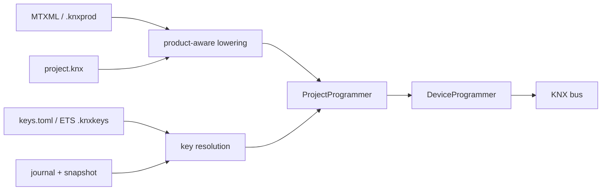

# Programming Real Devices

The host tools commission BCU1, BCU2, System 7, and System B devices from a
human-editable project. Product structure still comes from MTXML/`.knxprod`
and mask procedures still come from `knx_master.xml`; the project supplies the
installation-specific identity, parameters, object flags, group memberships,
and security policy.



The project layer is host-only. It does not add code or data to either embedded
stack.

> Hardware coverage includes BCU1, plain and secure BCU2, and plain and secure
> micro System 7 targets. The micro System 7 secure light switch has also been
> exercised on hardware. System B and the full System 7 paths have software-DUT
> coverage; qualify each connector/product combination before deploying it.

## Project directory

```text
bench/
├── project.knx
├── keys.toml
└── .zweidraehte/
    ├── snapshot.json
    ├── journal.jsonl
    └── project.lock
```

- `project.knx` is authored desired state. Product paths are relative to it.
- `keys.toml` is the authoritative plaintext credential store. Keep it out of
  source control when appropriate.
- `.zweidraehte/` is machine-written mutable state. Do not edit or merge it.
  A lock is held for the entire mutable bus session.

Opening, checking, and dry-running a project do not create keys or state. The
first real save/programming operation initializes both with the same random
`state_id`. A mismatch or missing mutable state blocks secure group sending
until explicit recovery.

## Project language

This is intentionally a small subset of the future project DSL:

```knx
ga kitchen_switch = 1/0/1
ga all_off = 0/0/1

net kitchen_switch : 1.001 {
    security authentication_confidentiality
}

net all_off : 1.001 {
    security automatic
}

area 1 bench {
    line 1 main {
        medium tp1

        device button {
            product local:"products/button.mtxml"
            address 1.1.10
            serial "00FA:00000001"
            max_apdu 40

            param "M-00FA_A-0001_P-1" = 3

            object 0 {
                on kitchen_switch
                flags {
                    communication true
                    transmit true
                }
            }
        }

        device relay {
            product local:"products/relay.mtxml"
            address 1.1.20

            object 0 {
                on kitchen_switch
                also on all_off
                flags {
                    communication true
                    write true
                    update true
                    priority low
                }
            }
        }
    }
}

external_sender visualisation {
    address 1.1.250
    on kitchen_switch
}
```

`on` is the sole primary/sending association. `also on` adds listening
associations. Flags belong to the communication object, not an association,
and layer over product defaults and visible `ComObjectRef` overrides. Each
field is optional: `communication`, `read`, `write`, `transmit`, `update`,
`read_on_init`, and `priority`.

An object with memberships needs exactly one primary. Effective `T`, `R`, or
`I` without one is rejected. `I` without `U`, and traffic flags with `C =
false`, are warnings. All memberships of one object must resolve to one Data
Secure protection mode because PID 61 is per object. Net DPTs are checked
against the effective product DPT and payload width.

Security policies are `plain`, `automatic`, `authentication`, and
`authentication_confidentiality`. `automatic` becomes authentication plus
confidentiality when a group key resolves; otherwise it remains plain.

## Keys

`keys.toml` separates per-device credentials from group keys and epochs:

```toml
version = 1
state_id = "generated-project-state-id"

[device.button.fdsk]
kind = "fdsk"
encoding = "knx_fdsk"
value = "AD5N5L-N654AA-CAQDAQ-CQMBYI-BEFAWD-ANBYHX"
origin = "device_label"

[device.button.tool_key]
kind = "tool_key"
encoding = "hex"
value = "00112233445566778899AABBCCDDEEFF"
origin = "generated"

[group.kitchen_switch]
active_epoch = 1

[group.kitchen_switch.epochs.1]
kind = "group_key"
encoding = "hex"
value = "102132435465768798A9BACBDCEDFE0F"
state = "active"
origin = "manual"
```

FDSKs accept 32 hexadecimal digits or a CRC-checked KNX label. Labels also
carry a serial number; disagreement with `project.knx` or an ETS keyring is an
error. Tool and group keys contain 32 hexadecimal digits. Equal project and
keyring values merge; conflicts fail before bus access. Keyring-only secrets
are never copied into `keys.toml`.

If a device has only an FDSK, programming generates and atomically persists a
random tool key before opening the bus. A retry therefore tries the same tool
key first even if the first acknowledgement was lost. Group keys are never
generated implicitly. Changing an already deployed active group key is
rejected until a rotation workflow exists.

Use `--keyring FILE` with `--keyring-password` or
`KNX_KEYRING_PASSWORD` to merge a read-only ETS `.knxkeys` export.

## Sequence numbers and SIAT

Application Layer §5.3.1 gives the client one outgoing sequence counter for
secure management and group communication. Its successor is appended and
fsynced before a protected frame is handed to the transport layer. Authenticated
incoming floors are persisted before plaintext delivery. Imports and sync may
only move floors forward.

Managed sender observations are keyed by serial; unmanaged senders are keyed
by IA. A target SIAT is rebuilt completely from effective `C && (T || R || I)`
senders on primary associations, declared external senders, keyring sender
lists, retained live rows, and stored observations. PID 54 stores last-valid,
so an observed sender `next` value is written as `next - 1`. Obsolete rows are
removed.

`knx-loader sync` authenticates with all managed secure devices and advances
local floors. `recover-state` additionally reads PID 59 and every relevant
SIAT. Recovery fails when a required receiver is unavailable unless the
operator supplies a conservative higher `--client-floor`; group sending stays
blocked until recovery completes.

## Commands

Master data resolves from `--master-data`, a product archive, the
`KNX_MASTER_DATA` environment variable, or the cache at
`~/.cache/knxprod/`.

```bash
# Generate a commented one-device project skeleton.
cargo run --bin knx-dump -- product.knxprod -o project.knx

# Validate products, keys, DPTs, capacities, and compile every device.
cargo run --bin knx-loader -- --project project.knx check

# Show exact stale/current and recovery state.
cargo run --bin knx-loader -- --project project.knx status

# Offline compile; creates neither keys nor mutable state.
cargo run --bin knx-loader -- --project project.knx load button --dry-run

# Program one device. Refuses if its affected closure contains others.
cargo run --bin knx-loader -- --project project.knx --usb load button

# Preflight and program the complete affected closure.
cargo run --bin knx-loader -- --project project.knx --usb load button --affected

# Program every stale device.
cargo run --bin knx-loader -- --project project.knx --usb load --all

# Explicit programming-button assignment (required for BCU1).
cargo run --bin knx-loader -- --project project.knx --usb load button --program-ia

# Read addressed product regions or unload without implicitly moving the IA.
cargo run --bin knx-loader -- --project project.knx --usb read button --out dumped/
cargo run --bin knx-loader -- --project project.knx --usb unload button

# Synchronise or reconstruct secure mutable state.
cargo run --bin knx-loader -- --project project.knx --usb sync
cargo run --bin knx-loader -- --project project.knx --usb recover-state
```

BCU2, System 7, and System B use serial assignment automatically when a serial
is available. The operation locates exactly one serial, refuses an occupied
destination, writes the IA, and verifies it by serial. BCU1 uses the explicit
programming-button path. `read` and `unload` may locate by serial but never
change the address.

Before mutating any device, an affected batch loads every product, resolves
all keys, reads live DD0, selects the real mask, reads live SIAT where needed,
and compiles every member. Partial failures record successful devices and mark
the whole batch visibly inconsistent.

## TUI

`knxproj-tui` reuses the same product/object editors and programming worker:

```bash
cargo run -p knxproj-tui -- project.knx --device button --usb
cargo run -p knxproj-tui -- product.mtxml
cargo run -p knxproj-tui -- product.knxprod
```

Product-only mode starts with an in-memory draft. The first `e` save or `p`
programming attempt atomically creates a one-device project beside the
product, then initializes matching keys and mutable state. Programming cannot
start unless this persistence succeeds.

The parameter editor follows product visibility. Communication-object group
addresses and object-wide flag overrides are edited separately; the table
shows the effective values and whether each came from the product, visible
reference, or project. `s` cycles the selected primary net's policy, and `P`
opens the project/net/masked-key/state dashboard. `K` opens the masked key
editor for device FDSKs/tool keys and active group-key epochs; entered secret
text is never rendered and each accepted value is written atomically. `p`
saves first and programs the selected device plus its affected closure; `A`
programs every stale device through the same shared pipeline.

## What the download does

`DeviceProgrammer` reads DD0 before address mutation, selects the mask's load
procedure, negotiates APDU size, selects tool-key/FDSK/plain management access,
installs a tool key if required, and verifies IA, DD0, completed load-state
machines, Security Mode, and readable security-table structure.

Management and application security remain independent. A plain application
may be downloaded over secure management without receiving Security IO tables.
A secure application always receives a Security IO phase, even with no secured
group objects. PID 59 is advanced to the maximum of the live device value,
stored observation, and KNX-epoch millisecond floor before Security IO is
downloaded; its confirmation is authenticated with the newly written number.

BCU1 uses direct diffed memory writes. BCU2 and System 7 use their mask/product
load-state procedures and table layouts. System B uses property-addressed,
device-allocated tables. Primary memberships lower first, preserving the
sending-address convention in every association-table coding.

## Troubleshooting

- `device identity mismatch` means the product application/version does not
  match the hardware.
- `project state: identity mismatch` or `recovery required` means secure group
  sending is deliberately disabled; run `recover-state`.
- `load ... also affects ...` means a sender, membership, IA, policy, GA, or
  key dependency changes another device's SIAT/tables. Use `--affected`, or
  `--force-single` only as an explicit unsafe diagnostic escape hatch.
- `parameter ... is not visible` means another product selection owns that
  field or union member.
- Vendor-bundled ETS5 master data may be too old for the parser. Let the
  resolver use the current cache/download instead.
