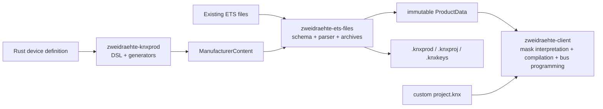

# ETS File Formats and Packages

`zweidraehte-ets-files` is the host-side foundation for data exchanged with
ETS. It owns the XML representations and package mechanics; it does not know
how to talk to a KNX device or how a Rust device definition is authored.

This boundary keeps ownership explicit:



- `zweidraehte-knxprod` turns Rust definitions into manufacturer XML. Its
  `KnxprodBuilder` retains convenient MTXML and signed `.knxprod` output, but
  delegates XML/package mechanics to this crate.
- `zweidraehte-ets-files` reads, writes, normalizes, preserves, and signs ETS
  files. It is usable without the generator.
- `zweidraehte-client` interprets mask data and compiles installation-specific
  configuration for the wire. Protocol identifiers remain in
  `zweidraehte-proto`.
- `zweidraehte-project` remains the separate, human-authored commissioning
  syntax and durable deployment-state store. It is not an ETS `.knxproj`
  representation.

## Modules

| Module | Responsibility |
|---|---|
| `schema` | Serde DTOs for ApplicationProgram, Hardware, Catalogue, Baggage, master data, and project XML |
| `xml` | Canonical UTF-8 XML serialization with a declaration and two-space indentation |
| `runtime` | Editable product-configuration model, dynamic-page traversal, translations, and baggage lookup |
| `product` | Immutable normalized `ProductData`, `ManufacturerContent`, decoded segments, parameter/property locations, communication objects, fixups, security capacities, and load procedures |
| `archive` | Lossless ZIP storage plus typed `.knxprod` and `.knxproj` views and product selection |
| `project` | `ProjectDefinition`, topology placement, validation, and `KnxprojBuilder` |
| `keyring` | Password-protected ETS `.knxkeys` import/export with redacted, zeroizing secret storage |
| `signing` | Schema versions, master-data sources, converter-key parsing, hashes, signatures, and package creation |

`runtime::Device` is editable product-configuration state for viewers and
project lowering. It does not contain master data. `product::ProductData` is a
separate immutable compilation input: callers configure devices through
`LoweredDeviceConfiguration` in the client instead of modifying product
facts.

## Cargo features

The crate has no default features. The XML schemas, canonical codec, runtime
model, normalized product model, project-document generation, and local
master-data parsing are always available.

| Feature | Adds |
|---|---|
| `archives` | `.knxprod` and `.knxproj` ZIP reading/writing and selection |
| `signing` | Converter signing and signed package creation; implies `archives` |
| `knxkeys` | Encrypted ETS keyring parsing and export |
| `master-data-download` | Versioned cache and retrieval from `update.knx.org` |
| `test-fixtures` | Synthetic product builders for downstream compiler tests only |

Consumers should enable only the boundary they use. In particular, parsing
loose MTXML does not require ZIP, HTTP, or RSA dependencies.

## Product selection

Use `archive::load_program` for both loose MTXML and `.knxprod` inputs.
`ProgramSelection` carries optional catalogue-product and application-program
IDs. The loader rejects missing, ambiguous, or mismatched selectors instead
of silently choosing the first application program. The TUI, `knx-config`,
and the client project loader share this path.

Generated `KnxprodOutput` converts into `product::ManufacturerContent`.
Imported `.knxprod` and `.knxproj` archives can produce the same neutral
manufacturer bundles, so `project::KnxprojBuilder` accepts generated and
imported content uniformly. Project devices reference catalogue-product and
application-program IDs; the builder validates that relationship and supports
multiple manufacturer directories and topology areas/lines.

## Archive preservation

`archive::RawArchive` retains every ZIP entry's path and byte payload. Typed
archive views parse known documents on demand, but unsupported XML, baggage,
and auxiliary entries stay opaque. Replacing a known document changes only
that entry; untouched entries remain byte-identical.

An unmodified archive can return its original bytes. Once a signed directory
is dirty, writing requires a caller-supplied `signing::ConverterKey` and
refreshes that directory's signature. Reading treats signatures as packaging
metadata; this crate does not claim signature verification.

## Signing and secrets

Private converter-key material is never embedded or discovered implicitly.
The caller must construct `ConverterKey` from explicitly selected XML or a
file and pass it to the package builder/writer. `converter_key.xml` is
git-ignored and must never be committed.

The `.knxkeys` API keeps decrypted passwords, authentication strings, FDSKs,
tool keys, backbone keys, and group keys private. Construct them through the
checked builders and borrow them through accessors. Their diagnostics are
redacted and the owning storage has an explicit zeroization path.

## Verification

Use both feature extremes when changing the foundation:

```bash
cargo test -p zweidraehte-ets-files --no-default-features
cargo test -p zweidraehte-ets-files --all-features
cargo clippy -p zweidraehte-ets-files --all-features --all-targets --no-deps -- -D warnings
```

Archive/signing changes also require generator and project-tool tests.
Changes that can affect normalized product bytes or client lowering require a
fresh `conformance-configuration` run after rebuilding DUTs. Never run another
Cargo command concurrently with a conformance runner.
