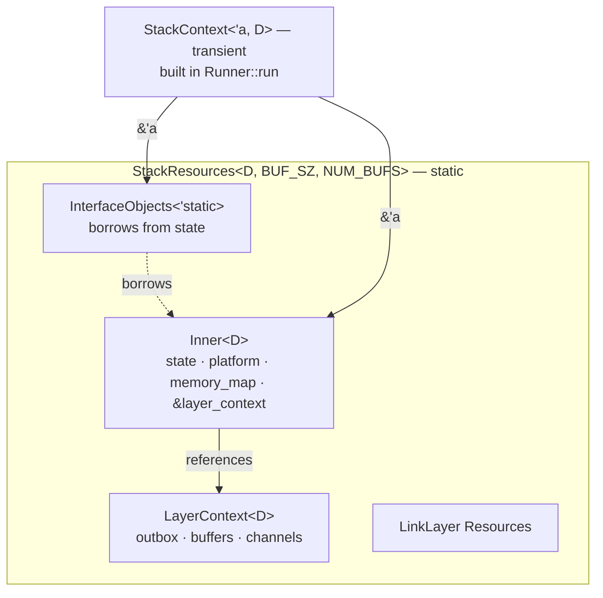
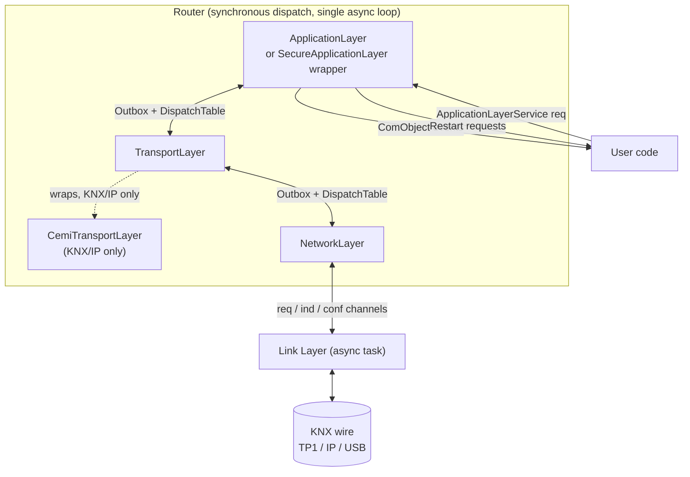

# Stack Architecture

This document is the reference for the zweidraehte KNX device stack's
design philosophy, the responsibilities of each component, and the full
surface of context traits that tie everything together.

It complements — but does not replace — the two existing references:

- [`DEVICE_DEFINITION.md`](DEVICE_DEFINITION.md) — how to define a
  concrete device and wire it into `main`.
- [`DSL_REFERENCE.md`](DSL_REFERENCE.md) — the ETS parameter /
  communication-object macro DSL.

Read this document when you are trying to understand *why* the stack
is shaped the way it is, *which* extension point to reach for, or
*what* a given context-trait bound actually requires.

---

## 1. Design philosophy

### 1.1 Goals

- Run the same core stack on embedded `no_std + no alloc` targets
  (the `cross/` subtree) and on embedded Linux userspace (the
  `examples/testutil` binaries).
- Be generic over link medium (TP1, KNX/IP, USB, IP-interface,
  mock), over BCU style (System B today; more later), and over
  per-device extensions (security, diagnostics, custom interface
  objects).
- Stay conformance-compliant against the KNX specifications in
  `spec/` without fossilising any single device's wiring into the
  core.

### 1.2 Guiding technique: compile-time composition

The stack is built through generics and trait bounds rather than
runtime polymorphism. There is no `dyn` on hot paths. The single
central type parameter `D: StackDefinition` threads through every
generic function and every shared type. Monomorphization specialises
each concrete device into the exact code it needs.

The router's dispatch table is not looked up at runtime from a
registry — it is a `const [u8; 256]` array built at compile time from
each layer's `HANDLES` slice. A duplicate `ServiceType` registration
fails to compile. Layer stacks are composed via the
`impl_layer_stack!` macro over tuples up to eight layers, so
`(NetworkLayer, TransportLayer, ApplicationLayer)` is a single
compile-time type with a known dispatch shape.

### 1.3 Three pillars

1. **A single "bill of materials" trait.** `StackDefinition`
   enumerates every choice a concrete device makes: descriptor,
   state, link-layer builder, interface-object container, layer
   composition strategy, memory map, application services,
   identity. Everything else asks for `D: StackDefinition` and
   drills through its associated types and constants. See
   [`crates/zweidraehte-device/src/definition.rs`](../crates/zweidraehte-device/src/definition.rs).

2. **Small single-responsibility "context" traits.** A layer or
   augment depends on the narrow capability it actually uses —
   `BufferManagerContext`, `ApduLengthContext`,
   `AddressTableContext`, `PropertyServiceContext`, and so on. Big shared
   containers (`LayerContext<D>`, `StackContext<'a, D>`) implement
   many of these traits; consumers accept
   `ctx: &(impl A + B)`. This keeps every layer's bound explicit
   and local; it also keeps test fixtures small — the mock only
   needs to implement the traits the layer under test actually
   calls.

3. **Persistence and runtime form are separated by convention.** The
   suffixes `*Config`, `*State`, `*Resources`, `*StateInit` carry
   stable meaning (see §4). A `*Config` is serde-serialisable;
   a `*State` has interior mutability and does not serialise;
   `*Resources` are non-persistent construction-time inputs;
   a `*StateInit` is the envelope `StackDefinition::create_state`
   receives.

### 1.4 Why two context containers?

The stack has **two** context bundles with different lifetimes:

- [`LayerContext<D>`](../crates/zweidraehte-device/src/context/layer.rs)
  — long-lived. Lives inside `StackResources` for the whole program
  lifetime. Holds the outbox, buffer manager, pub/sub channels,
  restart channel, and AL request channel. Not serialised — "long-
  lived" here means in-memory lifetime, distinct from the
  `*Config` persistence vocabulary in §4.
- [`StackContext<'a, D>`](../crates/zweidraehte-device/src/context/stack.rs)
  — transient. Built on the stack inside `Runner::run` and handed to
  link-layer builders and interface-object construction.

The split is not stylistic — it is forced by the ownership graph.
`Inner<D>` owns the device `State`. The `InterfaceObjects<'a>`
container borrows from that state (address tables, device object, …).
If a single context type stored both, it would be self-referential.
So `Inner` owns state; `StackContext` is assembled as a pair of
`&'a` references when needed; a prior attempt to fold the two back
together hit exactly this wall and is warned against in
[`context/stack.rs:8`](../crates/zweidraehte-device/src/context/stack.rs#L8).



---

## 2. High-level architecture

### 2.1 Layer diagram



Key points:

- **NL, TL, AL are synchronous** and share a single `Outbox`.
  Each implements the `Layer` trait with a compile-time
  `HANDLES: &'static [ServiceType]` slice.
- **The router is one async task** that selects on link-layer
  channels plus timer deadlines. On each event it pushes into the
  outbox and drains by re-dispatching through the `DispatchTable`.
- **The link layer is a separate async task** connected to the
  router over three channels (`req` to send, `ind` for incoming,
  `conf` for confirmations).
- **Secure AL is a wrapper** around the plain AL — it decrypts
  Secure Service APDUs on the way in and encrypts responses on the
  way out. It is not a parallel layer; it swaps in at composition
  time.
- **CemiTL** is a thin shim between the KNX/IP link layer and the
  standard TL, handling cEMI-framed service indications that TL
  itself does not natively consume.

### 2.2 Lifecycle

```
main
 ├─ load DeviceIdentity (serial number, optional FDSK)
 ├─ open stores (ConfigStore::open_at, SiatStore::boot, …),
 │  STORAGE.init(ConfigStorage::new(…)) → &'static stores struct,
 │  storage.load_config() (may be None on first boot)
 ├─ build D::StateInit { identity, optional loaded config }
 ├─ build link-layer builder (e.g. KnxNetIpBuilder, TpUartBuilder)
 │
 ├─ zweidraehte_device::new(resources, ll_builder, state_init,
 │                          platform, memory_map, storage)
 │    1. BufferManager::new → DynBufferManager
 │    2. LayerContext::new(buffer_manager, storage)  (program-lifetime)
 │    3. D::create_state(state_init)        → D::State
 │    4. Inner { state, platform, memory_map, &layer_context }
 │    5. D::create_interface_objects(state, platform, layer_ctx)
 │
 └─ Runner::run
      ├─ Build StackContext<'a, D>  (transient: &Inner, &InterfaceObjects)
      ├─ D::LayerBuilder::build(&stack_context, &channels)
      ├─ LayerStack::init()
      │    — DeviceModel init, AL read-on-init, etc.
      └─ async loop
           select:
             · LL::ind       → push → drain DispatchTable
             · LL::conf      → push → drain
             · timer deadline → LayerStack::poll
             · service input → LayerStack::handle_service_input
```

---

## 3. Core components

Each subsection gives the canonical file, the one-line purpose, the
context traits the component *requires* from its environment, and the
context traits it *provides*.

### 3.1 `StackDefinition`

**File:** [`crates/zweidraehte-device/src/definition.rs`](../crates/zweidraehte-device/src/definition.rs)

The compile-time bill of materials. Every concrete device (binary)
defines a zero-sized struct and implements `StackDefinition` for it.

| Item | Kind | Default | Purpose |
|---|---|---|---|
| `DEVICE` | `&'static DeviceDescriptor` | — | Mask version, manufacturer ID, hardware type, app ID/version, table capacities, PEI type. |
| `MAX_APDU_LENGTH` | `u16` | `MAX_APDU_LENGTH_EXTENDED` (255) | Compile-time buffer allocation ceiling. Runtime value may be lower. |
| `DEVICE_DESCRIPTOR_TYPE2` | `Option<&'static [u8;14]>` | `None` | Extended device descriptor. |
| `USER_MANUFACTURER_INFO` | `Option<&'static [u8;3]>` | `None` | Optional. |
| `TL_MAX_INCOMING` | `usize` | `1` | Max incoming transport connections. |
| `TL_MAX_OUTGOING` | `usize` | `0` | Max outgoing transport connections. |
| `TL_STYLE` | `TlStyle` | — | TL state-machine style per 03/03/04 §5.4. |
| `Mutex` | `RawMutex` | `NoopRawMutex` | Inter-executor synchronisation. `CriticalSectionRawMutex` when user code and stack share preemption. |
| `Rng` | `rng::Rng` | `NoRng` | Random-byte source for KNX Data Secure. Secure compositions require `Rng: SecureRng` (the default `NoRng` panics on use and is rejected at compile time by the `SecureDeviceBuilder` bound). |
| `Platform` | — | `()` | IP platform (network config/query). |
| `P` | `ConstDefault` | — | Application parameter struct. |
| `CO` | `ComObjects` | — | Communication-object container. |
| `LLB` | `LinkLayerBuilder<StackContext<Self>>` | — | Link-layer builder. |
| `ES` | `Extension<Self::Platform>` | — | Medium extension (state + augment). |
| `State` | `CoreDeviceState<Self::CO>` | — | Unified runtime state + tables. |
| `Identity` | `DeviceIdentity` | `StaticIdentity` | Factory identity. Use `StaticSecureIdentity` for Data Secure. |
| `StateInit` | — | — | Envelope passed to `create_state`. Not serialisable. |
| `Mem` | `MemoryMap<Self::State>` | — | Dispatcher for `A_Memory_Read/Write`. |
| `InterfaceObjects<'a>` | `PropertyServiceHandler + HasDeviceObject` | — | Container of interface objects. |
| `AlExtensions` | `ApciHandler<Self> + Default` | `()` | Extra AL APCI handlers. Composed by tupling — e.g. `(SystemBAlServices, DomainAddressService)`. |
| `Augments<'a>` | `Augment<Self>` | `()` | Device-wide augment chain. See §3.12. |
| `LayerBuilder` | `LayerStackBuilder<Self>` | — | Wires NL/TL/AL together. |

**Methods required:** `create_state(init) -> State`,
`create_augments(state, platform, layer_ctx) -> Augments<'a>`, and
`create_interface_objects(state, platform, layer_ctx, augments) -> InterfaceObjects<'a>`.
The runner calls them in that order — augments are built first so the
IO container can borrow `&'a Augments<'a>` for the stack's lifetime.

**Convenience supertrait.** System B devices should implement the
`SystemBStackDefinition` supertrait instead
([`crates/zweidraehte-device/src/bcus/system_b/definition.rs`](../crates/zweidraehte-device/src/bcus/system_b/definition.rs)),
which derives `ADT_SIZE`, `AST_SIZE`, `COT_SIZE`, `memory_layout()`
and `memory_map()` from the descriptor so devices do not repeat them.

**Provides:** the universal type parameter `D` that every other
component takes as input.

### 3.2 Router and the three service traits

**Files:**
[`crates/zweidraehte-device/src/router.rs`](../crates/zweidraehte-device/src/router.rs),
[`crates/zweidraehte-device/src/service/`](../crates/zweidraehte-device/src/service/)

The runtime dispatches wire frames through three small traits, each
owning one role. None inherits from a common base — empty supertrait
methods are noise for the 80% of services that don't need them.

```rust
//! crates/zweidraehte-device/src/service/traits.rs

/// Wire-message handler. NL / TL / AL / SecureAL all implement this.
/// No per-call context: layers capture their environment (`&D::State`,
/// `&LayerContext<D>`, …) at construction from the `StackContext`.
pub trait Layer<D: StackDefinition> {
    const HANDLES: &'static [ServiceType];
    fn init(&mut self) {}
    fn next_deadline(&self) -> Option<Instant> { None }
    fn poll(&mut self) {}
    fn process(&mut self, msg: KnxMessageBuffer<Buffer<'static>>);
}

/// APCI fall-through extension inside the AL (Memory, Authorization,
/// PropertyExt, …). Stateless or near-stateless; no lifecycle.
pub trait ApciHandler<D: StackDefinition> {
    fn try_handle_apci(
        &self,
        apci: ApciCode,
        msg: &KnxMessageBuffer<Buffer<'static>>,
        ctx: &AlCtx<'_, D>,
    ) -> bool;
}

/// Interface-object property hooks + IO-list contribution. Security,
/// IP, Diagnostics, Tp1 etc. implement this.
///
/// This is the same `Augment<D>` trait that the
/// services-struct aggregator uses (see §3.2 below). Every method
/// carries a sensible default (`None` / `0`), so leaf augments
/// override only the hooks they actually service.
pub trait Augment<D: StackDefinition> {
    fn additional_object_count(&self) -> u16 { 0 }
    fn additional_object_type_at(&self, _index: u16) -> Option<InterfaceObjectType> { None }
    fn get_property_descriptor(&self, _ot: InterfaceObjectType, _pid: u16) -> Option<PropertyDescriptor> { None }
    fn property_description_read(&self, _ctx: &ServiceCtx<'_, D>, …) -> Option<…> { None }
    fn property_value_read   (&self, _ctx: &ServiceCtx<'_, D>, …) -> Option<…> { None }
    fn property_value_write  (&self, _ctx: &ServiceCtx<'_, D>, …) -> Option<…> { None }
    fn function_property_command   (&self, _ctx: &ServiceCtx<'_, D>, …) -> Option<…> { None }
    fn function_property_state_read(&self, _ctx: &ServiceCtx<'_, D>, …) -> Option<…> { None }
}
```

#### Mutability story

* `Layer::process / poll / init` take `&mut self` — connection
  tables, hop counters, sequence-number scratch space are plain
  fields with no `RefCell` boilerplate.
* `ApciHandler::try_handle_apci` and `Augment`'s property-hook
  methods take `&self` — they're often re-entered from inside
  another service's `process()` and a `&mut self` would deadlock the
  borrow checker. Stateless handlers (most of them) need nothing;
  the few that hold state use `Cell<T>`.

#### Two contexts

* `ServiceCtx<'a, D>` — lean: `state`, `lctx` (LayerContext),
  `access` (AccessContext for the request being processed). Carried
  by `Augment`'s property hooks; constructed per-request by the AL
  and the IO container with the request's real `AccessContext`.
* `AlCtx<'a, D>` — rich: holds a `ServiceCtx` as its public `base`
  field (no `Deref` — contexts are not smart pointers), adds
  `interface_objects` and `memory_map`. Carried by
  `ApciHandler::try_handle_apci`, since AL extensions reach into
  property dispatch and memory.

#### `HANDLES` and the const dispatch table

`HANDLES` is a `const &[ServiceType]` so the dispatch table is built
at compile time. A duplicate `ServiceType` across layer fields fails
to compile — `DispatchTable::register` asserts that each slot is
empty before writing.

`Outbox` is a single FIFO ring buffer (capacity 8, enough for a full
indication→response chain with headroom for side outputs). Push order
is drain order, so an augment that must send a bus telegram *after*
the management response — e.g. GO diagnostics emitting a
`GroupValue_Write` only after acknowledging the management command —
simply pushes it after the response.

#### Device-level registry trait — `LayerRegistry`

A device's layer services don't implement `Layer<D>` directly on a
tuple. They live as named fields on a per-device **services struct**
that implements the registry trait:

```rust
//! crates/zweidraehte-device/src/service/registry.rs

/// Wire dispatch + lifecycle aggregation across `#[service(handler)]`
/// fields. Built at compile time by the macro.
pub trait LayerRegistry<D: StackDefinition> {
    const DISPATCH_TABLE: DispatchTable;
    fn dispatch_wire(&mut self, idx: u8, msg: KnxMessageBuffer<…>);
    fn init_layers (&mut self);
    fn poll_layers (&mut self);
    fn next_layer_deadline(&self) -> Option<Instant>;
    type ServiceInput = !;
    fn recv_service_input(&self) -> impl Future<Output = Self::ServiceInput> + '_ { pending() }
    fn handle_service_input(&mut self, _input: Self::ServiceInput) {}
    fn drain_events(&mut self) {}
}
```

The runner only ever sees `LayerRegistry<D>` — `Layer<D>` itself is
not visible at the device-services boundary.

`Augment<D>` (the full surface listed earlier) wears two
hats: a leaf augment implements it directly, and a services struct
that bundles augments implements an aggregating version emitted by
`#[derive(ServiceRegistry)]`. The aggregator walks
`#[service(augment | flatten)]` fields left-to-right; each property
hook returns the first `Some`, IO list counts sum. There is no
separate per-leaf trait — both authoring and aggregation use the
same surface.

#### `#[derive(ServiceRegistry)]`

Per-device services structs are written by hand and the macro emits
both registry impls from `#[service(...)]` field annotations:

```rust
#[derive(zweidraehte_device::service::ServiceRegistry)]
pub struct StandardLayerStack<'a, D: StackDefinition, AL: Layer<D>> {
    #[service(handler)] nl: NetworkLayer<'a, D>,
    #[service(handler)] tl: TransportLayer<'a, D>,
    #[service(handler)] al: AL,
    // … device_model, app_rx, etc.
}
```

For augment chains:

```rust
#[derive(zweidraehte_device::service::ServiceRegistry)]
pub struct PicoTp1Augments<'a> {
    #[service(augment)] tp1:    Tp1Augment<'a>,
    #[service(augment)] easter: EasterEggAugment,
}
```

The full attribute set on `#[derive(ServiceRegistry)]` fields:

| Attribute | Role |
|---|---|
| `#[service(handler)]` | A `Layer<D>` — wire-frame handler. Contributes to the const dispatch table via its `HANDLES` slice. |
| `#[service(augment)]` | An `Augment<D>` — property-dispatch + IO-list contributor. Hook calls walk left-to-right; first `Some` claims. |
| `#[service(flatten)]` | Embeds another services struct and inherits its augment chain wholesale. **Augment-only** — handlers can't flatten, since the const dispatch table would need a 2D mapping through the flattened sub-table. |
| `#[service(lifecycle)]` | A `LifecycleHook<D>` — runs `init` once before the router loop and `drain_events` after each dispatch cycle. For services-struct members that need lifecycle but neither dispatch a wire frame nor contribute to property dispatch (e.g. `DeviceModel`). |
| `#[service(channel(dispatch = path))]` | A receiver/`Channel` — the runner `select!`s on it inside the async loop. The `dispatch` path names a method on the services struct that consumes the received value. Used to wire actor-style request channels (`app_service_channel`) and cEMI events from KNX/IP runtime tasks into the same loop as wire frames. |

Hook methods on `Augment` walk fields left-to-right; the first `Some`
claims the request. IO list counts sum across all fields.

The `()` shape implements `Augment<D>` directly, so devices that need
no augments plug in without writing an empty impl. There is no
`&A: Augment<D>` blanket impl — every extension hands out a by-value
augment (`Tp1Augment<'a>`, `RfAugment<'a>`, …; see §3.12).

#### Service inputs and side-effect events

`recv_service_input` / `handle_service_input` let a services struct
subscribe to actor channels (user code's app-service requests, cEMI
events from a KNX/IP runtime task) and dispatch them on the same
async loop as wire frames. `drain_events` runs once per dispatch
cycle for stack-level coordination state — typically `DeviceModel`
transitions emitted by run-state-machine ticks.

**Context traits required by the router:** none directly. The
router operates on the device's `D::Services<'a>` (via
`LayerRegistry` + `Augment`) and `&LayerContext<D>`.

### 3.3 `LayerContext<D>` — long-lived

**File:** [`crates/zweidraehte-device/src/context/layer.rs`](../crates/zweidraehte-device/src/context/layer.rs)

Shared runtime infrastructure with program lifetime. Allocated once
inside `StackResources` and referenced by every layer at construction
via `&'static LayerContext<D>` — contrasted with
[`StackContext<'a, D>`](#34-stackcontexta-d--transient), which is
rebuilt on the stack in `Runner::run` each call. Nothing in here is
serialised; "long-lived" refers to in-memory lifetime only, not to
the `*Config` persistence vocabulary in §4. Contents:

| Field | Type | Role |
|---|---|---|
| `buffer_manager` | `DynBufferManager<'static>` | Pool of fixed-size message buffers. |
| `outbox` | `RefCell<Outbox>` | Inter-layer message queue (§3.2). |
| `event_channel` | `PubSubChannel<Mutex, (CO::Index, ComObjectEvent), 4, 4, 1>` | CO value changes delivered to user code + logger. |
| `lifecycle_channel` | `PubSubChannel<Mutex, LifecycleEvent, 4, 4, 1>` | Application lifecycle events. |
| `restart_channel` | `Channel<Mutex, RestartRequest, 1>` | Restart requests from the stack to user binary. |
| `app_service_channel` | `Channel<Mutex, Request<ApplicationLayerService, _>, 1>` | Actor-style requests *to* the AL from user code. |
| `group_data` | `GroupDataState` | Shared bookkeeping between AL's built-in group handler and augment-held `GroupDataProvider`s. |
| `storage` | `D::Storage` | The device's stores-struct handle (`&'static ConfigStorage<…>` etc.; `()` when unset). Layers pull stores from it through capability traits (e.g. `HasSeqStore`). |

**Context traits provided:** none — the buffer manager is a plain
`pub` field; `BufferManagerContext` is provided by `StackContext`.

**Inherent helpers (no trait):** `push_outbox(msg)`,
`publish_event(index, ComObjectEvent)`
(publishes a CO event on `event_channel`), and
`try_send_restart_request(RestartRequest) -> bool` (pushes a restart
request onto `restart_channel`) are inherent methods on
`LayerContext<D>` — consumers (layers, augments emitting telegrams)
call them directly on the concrete context, without going through a
context trait. A context trait would abstract nothing here: each
helper would have exactly one impl and no generic bound site.

### 3.4 `StackContext<'a, D>` — transient

**File:** [`crates/zweidraehte-device/src/context/stack.rs`](../crates/zweidraehte-device/src/context/stack.rs)

Transient bundle assembled at `Runner::run` scope. Holds two
references:

```rust
pub struct StackContext<'a, D: StackDefinition> {
    inner: &'a Inner<D>,
    interface_objects: &'a D::InterfaceObjects<'static>,
}
```

Accessors: `state()`, `layer_context()`, `interface_objects()`,
`memory_map()`. See §1.4 for why this cannot fold into `Inner`.

**Context traits provided** (all on `StackContext<'_, D>`):

- Always: `BufferManagerContext`, `ApduLengthContext`,
  `PropertyServiceContext`, `KnxIndividualAddressContext`,
  `AddressTableContext`.
- Conditional on `D::State: HasMaxRetryCount`: `MaxRetryCountContext`.
- Under `feature = "knxip"` and `D: IpCapableStack`:
  `DeviceInfoContext`, `IpDiagnosticsContext`,
  `IpAdditionalIndividualAddressContext`.

The `IpCapableStack` bound
([`context/stack.rs`](../crates/zweidraehte-device/src/context/stack.rs))
is a blanket-implemented alias that bundles
`D::State: HasExtensionState<ES: IpStateView>` and
`D::Platform: IpPlatform`, so IP-specific impls avoid repeating the
where clause.

### 3.5 `StackResources` and `Inner`

**Files:**
[`resources.rs`](../crates/zweidraehte-device/src/resources.rs),
[`inner.rs`](../crates/zweidraehte-device/src/inner.rs)

`StackResources<D, BUF_SZ, NUM_BUFS>` is a struct of `MaybeUninit`
fields placed in a `StaticCell`. Its fields are the entire physical
footprint of the stack:

- `inner: MaybeUninit<Inner<D>>`
- `buffers: MaybeUninit<[[u8; BUF_SZ]; NUM_BUFS]>`
- `buffer_manager: MaybeUninit<BufferManager<NUM_BUFS>>`
- `layer_context: MaybeUninit<LayerContext<D>>`
- `link_layer_resources: MaybeUninit<<D::LLB as LinkLayerBuilderBase>::Resources>`
- `augments: MaybeUninit<D::Augments<'static>>` — the device-wide
  augment chain. Built before `interface_objects` so the IO container
  can borrow `&'a D::Augments<'a>` across the stack's lifetime.
- `interface_objects: MaybeUninit<D::InterfaceObjects<'static>>`

`Inner<D>` is the owned core: `state: D::State`,
`platform: D::Platform`, `memory_map: D::Mem`,
`layer_context: &'static LayerContext<D>` (reference, because the
context lives in its own slot in `StackResources`).

`BUF_SZ` must be sized via
`config::buffer_size_for_apdu(D::MAX_APDU_LENGTH)`. `NUM_BUFS`
defaults to 8; the cEMI device-management path can hold up to four
simultaneously, so values below five risk deadlock.

### 3.6 Layers

All layers live under
[`crates/zweidraehte-device/src/layers/`](../crates/zweidraehte-device/src/layers/).

- **`network.rs` — `NetworkLayer`.** Validates hop count and routing.
  Handles `L_Data_Ind` / `L_Data_Req` / `L_Data_Con`.
- **`transport/mod.rs` — `TransportLayer`.** Connection-oriented
  state machine (styles 1–3 per 03/03/04 §5.4). Owns connection
  slots, connection timeout timers, and per-connection authorisation
  levels (stored on `State` via `HasConnectionAuth`).
- **`transport/cemi.rs` — `CemiTransportLayer`.** Thin wrapper used in
  KNX/IP stacks. Translates between cEMI-framed service indications
  and the standard TL's internal representation. Composed as
  `(NL, CemiTL<TL>, AL)` by `InsecureIpDeviceBuilder`.
- **`application/mod.rs` — `ApplicationLayer`.** Dispatches the AL's
  built-in APCIs inline (group communication, property read/write,
  `A_DeviceDescriptor_*`, `A_Restart`, individual address services).
  Anything else falls through to `D::AlExtensions: ApciHandler<D>` —
  a tuple of profile-specific APCI handlers (Memory, Authorization,
  PropertyExtValue, …). The standard set for System B is the
  `SystemBAlServices` 8-tuple in
  [`layers/application/services/mod.rs`](../crates/zweidraehte-device/src/layers/application/services/mod.rs).
  Property handling delegates to `StackDefinition::InterfaceObjects`
  via the `PropertyServiceHandler` object-safe trait.
- **`secure_application/mod.rs` — `SecureApplicationLayer<AL>`.**
  Wrapper. Detects Secure Service APDUs (APCI `0x03F1`), verifies
  and decrypts them, populates `AccessContext` with the security
  details, and forwards plaintext to the inner `AL`. The inner AL's
  `D::AlExtensions` chain runs after decryption. Outgoing responses
  are re-encrypted with the matching key before leaving the layer.

**Context traits required by layers** (selected, non-exhaustive; see
§5 for the full surface):

- AL requires: `BufferManagerContext`, `PropertyServiceHandler` on
  `InterfaceObjects`. Outbox writes, CO-event publishing, and restart
  requests use the inherent `LayerContext::push_outbox()` /
  `publish_event()` / `try_send_restart_request()` helpers.
- TL requires access to `HasConnectionAuth` on `D::State` for
  per-connection access levels.
- Secure AL additionally requires `HasSecurityState` on `D::State`
  and the sequence store via `D::Storage: HasSeqStore` (the capability
  forwards through the `&'static` stores-struct reference).

### 3.7 Link layers

**Directory:**
[`crates/zweidraehte-device/src/layers/linklayers/`](../crates/zweidraehte-device/src/layers/linklayers/)

Every link layer is a separate async task. It accepts
`StackContext<'a, D>` at build time (`LinkLayerBuilder::build_and_run`)
and pulls only the context traits it needs. The connection between
router and link layer is three channels: `req` (router→LL), `ind`
(LL→router), `conf` (LL→router).

| Medium | Module | Async | Context traits consumed |
|---|---|---|---|
| TP1 (TPUART / NCN / Elmos) | `tpuart/` | yes | `BufferManagerContext`, `ApduLengthContext`, `MaxRetryCountContext`, `KnxIndividualAddressContext`, `AddressTableContext` |
| KNX/IP | `knxip/` | yes | `BufferManagerContext`, `ApduLengthContext`, `PropertyServiceContext` (device-management connection), `DeviceInfoContext`, `IpDiagnosticsContext`, `IpAdditionalIndividualAddressContext` |
| KNX-RF (feature `rf`) | `knxrf/` | yes | `BufferManagerContext`, `RfDomainAddressContext`, `RfRetransmitterContext` (only with the `RetransmitEnabled` policy) |
| USB (HID) | `usb/` | yes | `BufferManagerContext`, `ApduLengthContext`, `PropertyServiceContext` |
| External IP interface | `ip_interface.rs` (feature `ip-interface`) | yes | `BufferManagerContext`, `ApduLengthContext` |
| Mock (tests) | `mock.rs` | yes | `BufferManagerContext` |

Builders implement two traits:

- `LinkLayerBuilderBase` — declares `Resources` associated type and
  the initialisation that does not depend on `StackContext`.
- `LinkLayerBuilder<StackContext<'a, D>>` — the actual build-and-run
  entry point that takes the transient context.

TP1 deserves a specific note: after chip detection, it calls
`ctx.set_max_apdu_length(…)` to reflect the chip's true capability
(56 for TPUART1/2, 248 for NCN/Elmos), clamped to
`D::MAX_APDU_LENGTH`.

KNX-RF shows how a link-layer *behaviour* is made compile-time optional
without a feature flag. The builder carries a zero-sized policy parameter,
`KnxRfLinkLayerBuilder<R, P = NoRetransmit>`. The DoA-retransmitter
behaviour (03/02/05 §6.1.7) lives in the `RetransmitEnabled` policy, whose
`LinkLayerBuilder` bound requires `CTX: RfRetransmitterContext`. A
`StackContext` only implements that trait when `D::State:
HasRfRetransmitter`, which only holds when the device composes the wrapper
extension `RfRetransmitterExtension<Inner>` (Security-style; it adds the RF
Medium Object's PID 57 and the Device Object's PID 74). So the *state +
interface-object surface* (the extension) and the *runtime behaviour* (the
policy) are two independent opt-ins that the type system forces to agree:
selecting the repeating link layer without the extension does not compile,
and a non-retransmitter device monomorphises the repeating path away
entirely. This pairing — wrapper extension for PIDs/state, ZST link-layer
policy for behaviour — is the template for medium capabilities that not
every device should pay for.

### 3.8 Objects and interface objects

**Directory:**
[`crates/zweidraehte-device/src/objects/`](../crates/zweidraehte-device/src/objects/)

Split into three modules:

#### `objects/interface`

Property-service infrastructure. Key types:

- **`InterfaceObject`** — each concrete object (Device,
  AddressTable, AssociationTable, GroupObjectTable,
  ApplicationProgram, PeiProgram) implements this with
  `property_descriptor_by_index/id`, `read_property`,
  `write_property`, `property_element_count`. Standard
  implementations live in
  [`objects/interface/standard.rs`](../crates/zweidraehte-device/src/objects/interface/standard.rs).

- **`PropertyServiceHandler`** — object-safe top-level dispatcher
  the AL uses to reach the `InterfaceObjects` container without
  knowing its concrete type. A blanket `impl` for `(A, B)` routes
  by object index offset, so containers compose by tupling.

- **`HasDeviceObject`** — type-safe accessors for common
  Device-Object properties (`DeviceControl`, `ProgrammingMode`,
  `RoutingCount`) without going through byte buffers. Required by
  `StackDefinition::InterfaceObjects<'a>`.

- **`Augment<D>`**
  ([`service/traits.rs`](../crates/zweidraehte-device/src/service/traits.rs))
  — the **hook** that extensions use to contribute property
  handling. Every method defaults to `None` / no-op. Returning
  `None` from a read/write hook passes through to the next augment
  (or to the base object if none intercepts). Augments can also
  claim whole new object indices via `additional_object_count()`
  and `additional_object_type_at()`. Augments emit telegrams by
  calling `ctx.lctx.push_outbox(msg)` on the
  [`ServiceCtx<'_, D>`](#32-router-and-the-three-service-traits)
  passed to each hook — `state`, `lctx` (for buffer allocation +
  outbox + event publishing), and `access` are all on the same
  context bundle.

#### `objects/comm`

Communication objects (`ComObjects` trait, `ComObjectEvent`,
`LifecycleEvent`). The user's `#[derive(EtsComObjects)]` struct
implements `ComObjects`; its `Index` enum types the
`LayerContext::publish_event(index, ComObjectEvent)` inherent helper.

#### `objects/tables`

Standard KNX tables and their `Has*` accessor traits. The `Table<I>`
wrapper adds a load-state machine on top of any inner
implementation.

- `addr7::AddrTab7Impl<N>` — Address Table (TSAP → GroupAddress).
  Trait: `HasAddressTable`.
- `asso6::AssoTab6Impl<N>` — Association Table (TSAP → ASAP).
  Trait: `HasAssociationTable`.
- `co7::CoTab7Impl<N>` — Group Object Table (CO type + flags).
  Trait: `HasCommunicationObjectTable`.
- `app::Application<P>` + `app::PeiApplication` — Load/Run state
  machines. Traits: `HasApplication`, `HasPeiApplication`.
- `HasLoadStateMachine`, `HasRunStateMachine` on the wrappers.

### 3.9 Communication objects and tables

Concrete table sizes come from the descriptor (the
`SystemBStackDefinition` supertrait computes `ADT_SIZE`, `AST_SIZE`,
`COT_SIZE` for you). The raw table bytes are built at compile time
by the `knx_stack_config!` macro
([`crates/zweidraehte-device/src/config.rs`](../crates/zweidraehte-device/src/config.rs)),
which accepts a declarative device configuration and emits:

- a struct holding the three table byte arrays,
- compile-time table-size consts,
- type aliases `AddrTab`, `AssoTab`, `CoTab`,
- a `create_tables()` constructor returning the three runtime table
  wrappers,
- (security arm) a pre-populated `SecurityExtensionConfig` builder.

### 3.10 Memory map

**File:** [`crates/zweidraehte-device/src/memory.rs`](../crates/zweidraehte-device/src/memory.rs)

```rust
pub trait MemoryMap<Tables> {
    fn read(&self, tables: &Tables, address: u16,
            data: &mut [u8], ctx: AccessContext)
            -> Result<usize, MemoryError>;
    fn write(&self, tables: &Tables, address: u16,
             data: &[u8], ctx: AccessContext)
             -> Result<usize, MemoryError>;
}
```

`Tables` is the runtime device state (e.g. `SystemBDeviceState`).
`AccessContext` carries the caller's authorisation level; the map
is responsible for access-level gating.

Implementations:

- `NoMemoryMap` — rejects everything with `NotAccessible`. Use for
  devices that do not need memory services.
- `SystemBMemoryMap`
  ([`bcus/system_b/memory_map.rs`](../crates/zweidraehte-device/src/bcus/system_b/memory_map.rs))
  — standard System B layout, derived from the device descriptor.

The AL's `MemoryService` and `UserMemoryService` consume the memory
map through `StackContext::memory_map()`.

### 3.11 BCUs — `system_b`

**Directory:**
[`crates/zweidraehte-device/src/bcus/system_b/`](../crates/zweidraehte-device/src/bcus/system_b/)

A complete pre-assembled implementation for mask versions `07B0`
(TP1) and `57B0` (KNX/IP). A device that wants to be System B
implements the `SystemBStackDefinition` supertrait and gets most
choices made for it.

Key pieces:

- **`definition.rs` — `SystemBStackDefinition`.** Supertrait that
  pins `Mem = SystemBMemoryMap`. Provides derived `ADT_SIZE`,
  `AST_SIZE`, `COT_SIZE` and default `memory_layout()` /
  `memory_map()`. Also provides type aliases (`Tp1StateFor<D>`,
  `IpStateFor<D, Proto>`, `SecureTp1StateFor<D, SEQ, P2P>`, etc.)
  that eliminate the repetition of `State` generic parameters.

- **`device_state/mod.rs` — `SystemBDeviceState<…>`.** The concrete
  `State` type. Implements `StackState`, `HasPersistence`,
  `HasAuthorization`, `HasConnectionAuth`, `HasDeviceConfig`,
  `DeviceModelNotifier`, `RestartHandler`, `HasExtensionState`, and
  all `Has*Table` traits. Stores individual address, auth keys,
  routing count, programming mode, the four core tables, comm
  objects, diagnostics state, extension state, and per-connection
  access levels. `to_config()` / `from_config()` handle persistence.

- **`extensions/` — four concrete extensions.** See §3.12 table.

- **`memory_map.rs` — `SystemBMemoryMap`.** Implements
  `MemoryMap<State>` for `A_Memory_Read/Write`.
  `MemoryLayout::from_descriptor()` computes byte offsets from the
  descriptor.

- **`storage.rs`** holds the vocabulary types: `DeviceConfig`,
  `ExtensionConfig`, `ExtensionState`, `Extension`,
  `HasDeviceConfig`, `HasSecurityMode`. Read the module-level
  docstring for the canonical `Config` / `State` / `Resources`
  definition.

- **`objects/` — `SystemBObjects<'a, D, ADT, AST, COT, APP, PEI, A>`.**
  The concrete `InterfaceObjects<'a>` container. Holds the six
  standard objects at indices 0–5 (Device, AddressTable,
  AssociationTable, GroupObjectTable, ApplicationProgram,
  PeiProgram) plus augment-contributed objects at 6+. Dispatch
  gives the augment first shot; returning `None` falls through to
  the base object. The helper function
  `create_system_b_objects::<D, _>(state, layer_ctx, &Self::memory_layout(), augments)`
  is how `create_interface_objects()` typically builds this — or
  call `Self::default_interface_objects(state, layer_ctx, augments)`
  on `SystemBStackDefinition` for the same wiring.

### 3.12 Extensions, augments, and `D::Augments<'a>`

**Files:**
[`bcus/system_b/storage.rs`](../crates/zweidraehte-device/src/bcus/system_b/storage.rs),
[`bcus/system_b/objects/mod.rs`](../crates/zweidraehte-device/src/bcus/system_b/objects/mod.rs),
[`bcus/system_b/extensions/`](../crates/zweidraehte-device/src/bcus/system_b/extensions/)

The stack has two complementary concepts that work together:

* **Extension** — a packaged feature that contributes *persistent
  state* (key tables, IP config, runtime counters) plus a recipe
  for producing the augment that exposes that state on the wire.
  Lives behind `D::ES`. Built into the device state at startup.
* **Augment** — the property-dispatch and IO-list-contribution hook
  itself. Implements `Augment<D>` (see §3.2). It is a small struct that
  *borrows* the extension state (and possibly the platform): `Tp1Augment<'a>
  { state: &'a Tp1ExtensionState }`, `RfAugment<'a> { state: &'a … }`, or
  `IpAugment<'a, P, CAPS> { config: &'a …, platform: &'a P }`. All
  extensions follow this one shape — `create_augment` builds the augment
  from `&'a self` (plus `&'a platform`).

Each device's complete augment set lives behind the
`D::Augments<'a>` GAT on `StackDefinition`. The IO container
(`SystemBObjects`) borrows `&'a D::Augments<'a>` and routes every
property hook through `Augment<D>`.

#### Extension trait surface

```
ExtensionConfig        :  Default + Serialize + Deserialize
ExtensionState         :  type Config: ExtensionConfig;
                          type Resources;
                          from_config(Config, Resources) -> Self
                          to_config() -> Config
                          on_erase(&self, code: EraseCode)
Extension<Platform>    :  (ExtensionState supertrait)
                          type Augment<'a, D>: Augment<D>
                          create_augment(&'a self, &'a Platform) -> Augment<'a, D>
```

`Resources` is the non-serialisable construction-time bundle (FDSK
copy, sequence-number storage handle, platform handles). `()` for
extensions that need none. `on_erase` is invoked from
`SystemBDeviceState::factory_reset()` and `execute_reset()` and
receives the `EraseCode` so each extension decides per code what to
clear.

For a leaf extension the persisted `ExtensionConfig` struct is just the
runtime `ExtensionState` with its `Cell`/`RefCell` fields unwrapped, and
`from_config`/`to_config`/`on_erase` are mechanical. `#[derive(ExtensionState)]`
generates all of that — the `*Config` struct, its `Default`/`ExtensionConfig`
impls, and the `ExtensionState` impl — from the state struct's fields. See
§7.2. (`Tp1ExtensionState`, `RfExtensionState`, `IpExtensionState` all use
it; the composing `SecureExtensionState` and the tuple-config retransmitter
hand-write theirs.)

The `Extension` trait survives because it lets devices spell
`<D::ES as Extension<D::Platform>>::Augment<'a, D>` as a clean type
alias — useful when the augment type contains const generics
derived from a `FeatureSet` (e.g. `IpAugment<'a, P, N, CAPS>`)
that you don't want to hand-write.

#### Concrete built-ins

| Extension | Medium | `Config` | `Resources` | `Augment` | Feature flag |
|---|---|---|---|---|---|
| `()` | any/none | `()` | `()` | `()` | — |
| `Tp1ExtensionState` | TP1 | `Tp1ExtensionConfig` | `()` | `Tp1Augment<'a>` | — |
| `RfExtensionState` | KNX-RF | `RfExtensionConfig` | `()` | `RfAugment<'a>` | — |
| `IpExtensionState<CAPS>` | KNX/IP | `IpExtensionConfig` | `()` | `IpAugment<'a, P, CAPS>` | `knxip` |
| `SecureExtensionState<Inner, GRP, P2P, GO>` | wraps any inner | `SecureExtensionConfig<…>` | `SecureResources<InnerResources>` | `(InnerAugment, SecurityAugment)` | — (seq store comes from `D::Storage`) |
| `OperationModeState` (runtime-only) | any | — (not persisted) | — | `DiagnosticsAugment` | — |

#### Composing augments on a device

A device has three ways to spell its `D::Augments<'a>`:

**1. Bare projection** — when there's only the medium extension's
augment, no extras. Saves writing a wrapper struct:

```rust
type Augments<'a> = <Self::ES as Extension<Self::Platform>>::Augment<'a, Self>;

fn create_augments<'a>(
    state: &'a Self::State,
    platform: &'a Self::Platform,
    _lctx: &'a LayerContext<Self>,
) -> Self::Augments<'a> {
    state.extension_state().create_augment::<Self>(platform)
}
```

**2. `#[derive(ServiceRegistry)]` struct** — when the chain has
multiple augments, gives each one a name. The macro emits the
`Augment<D>` impl from the field annotations:

```rust
#[derive(zweidraehte_device::service::ServiceRegistry)]
pub struct PicoTp1Augments<'a> {
    #[service(augment)] tp1:    Tp1Augment<'a>,
    #[service(augment)] easter: EasterEggAugment,
}

type Augments<'a> = PicoTp1Augments<'a>;

fn create_augments<'a>(state, platform, _lctx) -> Self::Augments<'a> {
    PicoTp1Augments {
        tp1:    state.extension_state().create_augment::<Self>(platform),
        easter: EasterEggAugment,
    }
}
```

**3. `#[service(flatten)]` composition** — when one chain wants to
inherit another's augments wholesale. Useful for sharing a
"conformance extras" bundle across stacks, or for layering a
profile-specific augment set on top of a base set:

```rust
#[derive(ServiceRegistry)]
pub struct ConformanceExtras<'a> {
    #[service(augment)] cert: CertificationObjectAugment,
    #[service(augment)] diag: DiagnosticsAugment<'a>,
}

#[derive(ServiceRegistry)]
pub struct SecureConformanceAugments<'a> {
    #[service(augment)] sec:    SecAugment<'a>,
    #[service(flatten)] extras: ConformanceExtras<'a>,
}
```

The outer struct's `Augment<D>` impl walks `sec` first,
then delegates the rest of the chain into `extras` (which itself
walks `cert` then `diag`).

#### The state / augment split

Every extension keeps *persisted state* and its *interface-object augment*
in two structs, and the augment **borrows** the state. The augment is what
`create_augment` builds; it holds `&'a State` (not an owned copy) so writes
reach the state's authoritative `Cell`/`RefCell` storage on `D::State`.

```rust
// TP1 — augment borrows only the state.
struct Tp1Augment<'a> { state: &'a Tp1ExtensionState }   // PID 52

// IP — augment borrows the state AND the platform, because half its PIDs
// read live network values the state doesn't own.
struct IpAugment<'a, P, const CAPS: u16> { config: &'a IpExtensionState<CAPS>, platform: &'a P }
```

`Tp1ExtensionState`'s `Extension::Augment` is therefore `Tp1Augment<'a>`,
symmetric with `RfAugment<'a>` and `IpAugment<'a, …>`. Devices spell
their augment-bundle fields by the augment type:

```rust
struct PicoTp1Augments<'a> {
    tp1:    Tp1Augment<'a>,                               // borrows the state
    easter: EasterEggAugment,                             // by value
}

struct PicoEthAugments<'a> {
    ip:     IpAugmentFor<'a, EmbassyNetworkInfo, KnxIpDeviceUdp>,
    easter: EasterEggAugment,
}
```

#### `*For<…>` type aliases

Several alias-helpers hide const-generic projection:

| Alias | Hides | Located in |
|---|---|---|
| `Tp1StateFor<D>` | ADT/AST/COT sizes from `D::DEVICE` | `bcus/system_b/definition.rs` |
| `IpStateFor<D, F>` | same + IP feature-set tunneling capacity & capability bits | same |
| `SecureTp1StateFor<D, SEQ, P2P, SIAT>` | same + Data Secure const generics | same |
| `SystemBInterfaceObjectsFor<'a, D>` | `DefaultSystemBInterfaceObjects<'a, D, D::Augments<'a>>` | `bcus/system_b/objects/mod.rs` |
| `IpAugmentFor<'a, P, F>` | `IpAugment` const generics from a `FeatureSet` | `bcus/system_b/extensions/ip/mod.rs` |

Each alias is right-sized: it spells the meaningful types and
hides only the const-generic plumbing that's mechanically derived.

### 3.13 Actors

**File:**
[`crates/zweidraehte-device/src/actor.rs`](../crates/zweidraehte-device/src/actor.rs)

Lightweight request/response, not a full actor framework. There are
no dedicated actor tasks or mailboxes. The primitives are:

- `Request<M, R>` — one-shot envelope carrying a message `M` and a
  single-slot reply sender for `R`. A `DropBomb` panics if the
  request is dropped without being processed or replied to, which
  catches silent cancellation bugs early.
- `ActorRequest<MUT, M, R>` trait — implemented on
  `DynamicSender<Request<M, R>>` and `Sender<'static, …>`. The
  `request(message)` method creates a temporary one-slot
  `Channel<MUT, R, 1>`, sends the request, and awaits the response.

Use sites:

- `LayerContext::app_service_channel` — user code sends
  `ApplicationLayerService` requests to the AL and awaits a
  response (for example, to read a CO value outside of a bus
  cycle).
- `LayerContext::restart_channel` — stack signals user code that
  the binary should restart.
- `Stack` public API methods that exchange a request and wait for a
  reply.

### 3.14 Identity and storage

**Directory:**
[`crates/zweidraehte-device/src/storage/`](../crates/zweidraehte-device/src/storage/)

Identity is factory-fixed; storage is the unified persistence layer.
A device declares each durable region **once** — a `Placed<R, C, L>`
alias naming the region marker (which carries the payload type,
mechanism, and capacities), the chip, and the device's layout type —
and everything else derives: the layout entry (`Placed::SPEC`, listed
in the `StorageLayout` impl's `REGIONS`), the proven placement, the
store type (`StoreOf<…>`), and the `open()`. The live stores group in
one of the three stores structs (`ConfigStorage` / `SecureStorage` /
`SecureIpStorage`) — one per real store combination, each carrying
its capability impls as ordinary code.

```rust
pub struct StorageMap;
type Cfg = Placed<StmConfigRegion<MyState>, StmFlash, StorageMap>;
type Seq = Placed<StmSiatRegion<SIAT_SIZE>, FramChip, StorageMap>;
impl StorageLayout for StorageMap {
    const REGIONS: &'static [RegionSpec] = &[Cfg::SPEC, Seq::SPEC];
}
type DeviceStorage = SecureStorage<StoreOf<Cfg>, StoreOf<Seq>>;
// main(): DeviceStorage::new(Cfg::open(io)?, Seq::open(fram_io)?)
```

- `identity.rs` — `DeviceIdentity` (`serial_number() -> &[u8; 6]`),
  `SecureDeviceIdentity: DeviceIdentity` (adds `fdsk() -> &[u8; 16]`),
  plus the compile-time `StaticIdentity` / `StaticSecureIdentity`.
  Testutil adds `FileIdentity`.
- `region.rs` — the layout vocabulary: `Region` (SIZE + MAGIC +
  KIND — the region knows which middleware is placed in it; the
  flash-vs.-FRAM deployment choice for the SIAT and mc_timer is a
  *marker* choice: `FlashSiatRegion` / `FramSiatRegion`,
  `McTimerRegion` / `FramMcTimerRegion`, same magic each), `Chip`
  (tag, base, capacity, sector size, and the `Copy` medium handle
  type `Io` — copies of one handle serve every region on the chip),
  `RegionSpec` / `RegionKind` (one declared entry as plain const
  data, built by the `region_spec` const fn), and `region_placement`
  (looks the entry up **by chip + region type** — tag + magic + size,
  no index to drift, so the same region type may live on two chips —
  and derives its prefix-sum offset; it fires `check_layout`'s
  capacity / magic / tag / medium guards on every call,
  const-panicking at the evaluation site). `RegionPlacement<R, C>` is
  tagged with its *region and chip* at the type level and each
  backend binds the same region as a generic parameter, so a store
  can only be opened at its own region's placement — and the region
  is the single source of the store's magic, extent, payload, and
  capacities.
- `layout.rs` — the device-facing declaration surface: `Stored<C>`
  (the region ↔ store coupling: `type Store`, `open(io, placement)`;
  implemented in core once per marker × medium contract, with the
  medium as a bound on `C::Io`), `StorageLayout` (the ordered region
  list as one associated const), `Placed<R, C, L>` (derives SPEC /
  placement / open from its three names), and `StoreOf` (the slot
  projection for the stores-struct alias). The layout proof fires at
  `open()`'s monomorphization — a generic-assoc-const forcing, so a
  bad layout is still a compile error.
- `definition.rs` —
  `HasDeviceConfig` (runtime state → serialisable config), the
  `HasConfigStore` capability, `StorageHooks` (the per-combination
  hooks), and the three stores structs `ConfigStorage` /
  `SecureStorage` / `SecureIpStorage` with their hand-written
  capability impls. A device with a different store combination
  hand-writes its own struct + the same three impls (see the
  conformance harness's `ConformanceSecureStorage`).
- `kv.rs` — the `KeyValueStore` seam between backends and views.
- `backends/` — `SectorIo` / `ByteIo` medium seams (the write
  granularity is a `SectorIo` fact: `WRITE_ALIGN`, 8 on STM32
  doubleword flash) and the HAL-free backends over them:
  `WearLeveledKv`, `ConfigStore`, `PackedSeqStore`, and
  `PackedWatermark` (the byte-medium mc_timer record).
- `views.rs` — the typed security tables over the seam: `SiatStore`,
  `McTimerStore`.
- `seq.rs` — `SequenceNumberStorage` (sending/receiving/tool-key
  sequence persistence for Data Secure) and `HasSeqStore` (typed
  access to the seq store on the stores struct; its presence gates
  the secure builders at compile time).
- `task.rs` — the generic `storage_task` every device spawns (via the
  `storage_task!` wrapper macro): restart handling, the advisory
  ETS-download-complete save, and the periodic dirty-save poll, each
  save behind an optional `SaveGuard` (TP1 busy gating). It takes the
  storage handle from the stack (`knx.storage()`).

The stores struct is carried on `StackDefinition::Storage`
(`&'static ConfigStorage<…>` etc.; `()` only for stacks with no
storage at all) and reaches every consumer through `LayerContext` and the
capability/context traits, exactly like the other tables: the secure
AL pulls the seq store via `HasSeqStore`, the KNX/IP Secure
link layer reads/writes the mc_timer watermark directly through its
context, and the storage task drives the config store.

---

## 4. Vocabulary — `Config`, `State`, `Resources`, `StateInit`

The canonical source is the module docstring at
[`bcus/system_b/storage.rs`](../crates/zweidraehte-device/src/bcus/system_b/storage.rs).
These suffixes carry stable meaning across the entire codebase:

| Suffix | Meaning | Serialised? | Mutability | Examples |
|---|---|---|---|---|
| `*Config` | Persisted form. Round-trips through `serde`. | Yes | Owned, rebuilt wholesale | `DeviceConfig`, `Tp1ExtensionConfig`, `IpExtensionConfig`, `SecurityExtensionConfig<…>` |
| `*State` | Runtime form with interior mutability (`Cell`, `RefCell`). Converts to/from `Config`. | No | `&self` mutation via accessors | `SystemBDeviceState`, `Tp1ExtensionState`, `IpExtensionState`, `SecurityState` |
| `*Resources` | Non-persistent construction-time inputs: pre-allocated buffers, handles, factory-programmed keys (FDSK), platform references. | No | Moved in once at build time | `StackResources<D, BUF_SZ, NUM_BUFS>`, `SecureResources<Inner, SEQ>` |
| `*StateInit` | Envelope passed to `StackDefinition::create_state`. Not serialisable; bundles optional loaded `Config` + identity data. | No | Consumed by `create_state` | `DemoStateInit`, `MdtStateInit` |

How they thread together:

```
Factory                 Flash / EEPROM              Runtime
-------                 --------------              -------
DeviceIdentity  ───┐    DeviceConfig                SystemBDeviceState
 serial, FDSK      │    └─ extension_config ─┐      └─ extension_state (Cell/RefCell)
                   │                         │
ExtensionResources ┼──> ExtensionConfig ─────┼─> ExtensionState
 SEQ storage,      │      (part of             (runtime form)
 FDSK copy         │       DeviceConfig)
                   │
                   └──> StateInit ─> create_state()
                                     │
                              StackResources
                              (MaybeUninit statics)
```

- The device's config store (`ConfigStoreBackend::load_config`) loads
  the optional `DeviceConfig`.
- `StateInit` carries identity + optional `DeviceConfig`.
- `create_state(StateInit)` calls `SystemBDeviceState::from_config`
  or `::new` (fresh).
- `ExtensionState::from_config(extension_config, resources)` builds
  the runtime extension state.

---

## 5. Full context-trait reference

All context traits, grouped by origin file. Every row gives
file, methods (short form), typical provider, and typical consumer.

### 5.1 Core (`context/traits.rs`)

| Trait | Methods | Provided by | Consumed by |
|---|---|---|---|
| `BufferManagerContext` | `buffer_manager() -> &DynBufferManager` | `StackContext<'a, D>` | All link layers (protocol layers reach the pool via their stored `&LayerContext` field) |
| `ApduLengthContext` | `max_apdu_length()`, `set_max_apdu_length(u16)` | `StackContext<'a, D>` | TPUART and USB link layers (read chip capability, update runtime limit) |
| `LinkLayerBufferContext` | (blanket supertrait combining the two above) | blanket impl on any `BufferManagerContext + ApduLengthContext` | Link layers that want a single bound |
| `PropertyServiceContext` | `property_handler() -> &dyn PropertyServiceHandler` | `StackContext<'a, D>` | KNX/IP Device Management connection; any LL-side management path |
| `MaxRetryCountContext` | `max_retry_count() -> u8` | `StackContext<'a, D>` (conditional on `D::State: HasMaxRetryCount`) | TPUART during chip init |
| `KnxIndividualAddressContext` | `individual_address() -> IndividualAddress` | `StackContext<'a, D>` | TPUART `AutoAddressChecker` |
| `AddressTableContext` | `type ADT`, `address_table() -> &RefCell<ADT>` | `StackContext<'a, D>` | TPUART `AutoAddressChecker` |

The outbox, CO-event publishing, and restart requests are **not**
behind a context trait. `LayerContext<D>` exposes them as inherent
helpers: `push_outbox(msg)` (augments
that need to emit telegrams — security GO diagnostics, cyclic group
writes — call it directly), `publish_event(index, ComObjectEvent)`
(AL group-data handler; augments with `GroupDataProvider`), and
`try_send_restart_request(RestartRequest) -> bool` (AL
`handle_restart()`). Context traits for these would each have a single
`LayerContext<D>` impl and no generic bound site, so they stay
inherent.

### 5.2 KNX/IP (`linklayers/knxip/context.rs`, feature `knxip`)

| Trait | Methods | Provided by | Consumed by |
|---|---|---|---|
| `DeviceInfoContext` | `device_information()`, `extended_device_information()`, `manufacturer_code()` | `StackContext<'a, D: IpCapableStack>` | Discovery service; SEARCH response builder |
| `IpDiagnosticsContext` | `ip_config()`, `ip_current_config()` | `StackContext<'a, D: IpCapableStack>` | Remote configuration server |
| `IpAdditionalIndividualAddressContext` | `write_additional_individual_addresses(&mut [IndividualAddress]) -> usize` | `StackContext<'a, D: IpCapableStack>` | Tunneling connection handler |

### 5.3 IP state (`ip.rs`)

| Trait | Role | Implemented by |
|---|---|---|
| `IpStateView` | Configured IP address, subnet, gateway, routing multicast, TTL, friendly name, project install ID, tunneling addresses (~20 accessors) | `IpExtensionState`, `IpAugment` |
| `IpPlatformState: IpStateView` | Current (live) IP address/subnet/gateway/MAC, assignment method, capabilities | `IpAugment` (delegates to platform) |

Also re-exported in `ip.rs`: the platform-provided
`IpPlatform` (= `zweidraehte_platform::NetworkInfo`) and
`IpPlatformConfig` (= `zweidraehte_platform::NetworkConfig`).

### 5.4 Device state (`state.rs`)

| Trait | Role | Implemented by |
|---|---|---|
| `StackState` | `individual_address`, `set_individual_address`, `serial_number`, `max_apdu_length` (get/set), `is_programming_mode`, `set_programming_mode`, `security_mode_enabled`, `log_access_denied`, `has_group_key` | `SystemBDeviceState<…>` |
| `HasAuthorization` | `max_access_levels`, `default_access_level`, `authorize(&[u8;4]) -> u8`, `key_write(level, key, ctx)` | `SystemBDeviceState<…>` |
| `HasPersistence` | `mark_dirty()` | `SystemBDeviceState<…>` |
| `CoreDeviceState<CO>` | supertrait bundle: `StackState + HasAuthorization + HasPersistence + HasAddressTable + HasApplication + HasAssociationTable + HasCommunicationObjectTable + HasCommObjects<CO=CO> + HasDiagnosticsContext + HasConnectionAuth + HasRoutingCount + DeviceModelNotifier` | blanket over anything meeting all bounds |

**Secure identity story.** There is no separate `HasSecureIdentity`
trait. `StackState::Identity` is a `DeviceIdentity` associated type;
secure call sites (the secure layer stack builder, the security
extension's tool-key seeding) bound it on `SecureDeviceIdentity` to
reach `fdsk()`. RNG is a separate associated type
`StackDefinition::Rng`; the `SecureDeviceBuilder` adds a `Rng:
SecureRng` bound that rejects the default `NoRng` at compile time.

### 5.5 Storage / identity (`storage/`)

| Trait | Methods | Typical impls |
|---|---|---|
| `DeviceIdentity` | `serial_number() -> &[u8;6]` | `StaticIdentity`, `FileIdentity`, embedded HAL wrappers |
| `SecureDeviceIdentity: DeviceIdentity` | `fdsk() -> &[u8;16]` | `StaticSecureIdentity` |
| `HasDeviceConfig` | `type Config; to_config()` — runtime state → serialisable config | `SystemBDeviceState` |
| `ConfigStoreBackend` | `type State; type Config; save(&state)`, `load() -> Option<Config>` | `ConfigStore`, `NoStore` |
| `McTimerStoreBackend` | `load`, `save`, `clear` | `McTimerStore` view (flash wear log), `PackedWatermark` (byte media), `NoStore` |
| `HasConfigStore` | `save_config(&state)`, `load_config()` on the stores struct (`&self`, per-store `RefCell`) | the three stores structs (+ forwarded through `&`) |
| `StorageHooks` | the per-combination hooks: `erase(code)` plus defaulted mc_timer watermark methods (overridden only by `SecureIpStorage`) | the three stores structs; `()` is the storage-less no-op |
| `SequenceNumberStorage` | sending / receiving / tool-key sequence persistence | `SiatStore` over `WearLeveledKv` / `PackedSeqStore`, shm store (conformance) |
| `HasSeqStore` | `type Seq; seq_store() -> &RefCell<Seq>` | `SecureStorage` / `SecureIpStorage` (its absence on `ConfigStorage` gates the secure builders) |

Every capability forwards through `&T`, so bounds are written directly
against the handle reference: `D::Storage: HasSeqStore` and the
storage task's `D::Storage: HasConfigStore + StorageHooks`.

Dirty tracking lives on the runtime state, not the stores.
`SystemBDeviceState` exposes inherent `is_dirty()` / `mark_dirty()` /
`clear_dirty()` methods; the storage task polls `is_dirty()` (and the
advisory ETS-download-complete notification) and calls
`save_config(&state)` through `HasConfigStore`. `mark_dirty()` is also
the single method on the `HasPersistence` trait, called by property
writes that mutate persisted state.

### 5.6 Extension-level (`bcus/system_b/storage.rs`)

| Trait | Role |
|---|---|
| `HasDeviceConfig` | `type Config; to_config() -> Config`. Bridge between runtime state and its serialisable config. |
| `ExtensionConfig` | Marker for `Default + Serialize + Deserialize`. |
| `ExtensionState` | `type Config: ExtensionConfig; type Resources; from_config(Config, Resources) -> Self; to_config() -> Config; on_erase(&self, code: EraseCode)`. |
| `HasSecurityMode` | `security_mode_enabled`, `log_access_denied`, `has_group_key`. Non-secure extensions use defaults (false / noop). |
| `Extension<Platform>` | Adds `type Augment<'a, D>: Augment<D>; create_augment(&self, &Platform)`. |

### 5.7 Security-specific (`bcus/system_b/extensions/security/mod.rs`)

| Trait | Role |
|---|---|
| `HasSecurityState` | Full API over group keys, P2P keys, GO flags, tool key, failure counters / log. The SIAT lives on the storage-layer seq store (`HasSeqStore` on the stores struct), not here. |

### 5.8 Interface objects

| Trait | Location | Role |
|---|---|---|
| `Augment<D>` | `service/traits.rs` | Property-service hook + IO-list contributor + lifecycle. Default everything to `None` / no-op. See §3.2. |
| `PropertyServiceHandler` | `objects/interface/` | Object-safe container-level dispatch trait. |
| `HasDeviceObject` | `objects/interface/` | Typed accessors for Device Object properties. |
| `HasExtensionState` | `bcus/system_b/device_state/mod.rs` | `type ES; extension_state() -> &ES`. Required for IP context impls and security layer wiring. |
| `HasDiagnosticsContext` | `bcus/system_b/extensions/operation_mode.rs` | `type Diagnostics; diagnostics() -> &Diagnostics`. |

### 5.9 Table accessors (`objects/tables/`)

`HasAddressTable`, `HasAssociationTable`,
`HasCommunicationObjectTable`, `HasApplication`,
`HasPeiApplication`, `HasLoadStateMachine`, `HasRunStateMachine`.
All implemented by `SystemBDeviceState`; consumed by the AL's
load/run state machines, group-communication dispatch, and the
memory map.

### 5.10 Platform (`ip.rs` re-exports from `zweidraehte-platform`)

| Trait | Methods | Implementations |
|---|---|---|
| `IpPlatform` | `current_ip_address`, `current_subnet_mask`, `current_default_gateway`, `mac_address`, `current_ip_assignment_method`, `ip_capabilities` | `LinuxIpTransport`, `MockIpPlatform` (testutil), `embassy-net` wrapper |
| `IpPlatformConfig` | `apply_ip_config(&IpConfig) -> Result<_, Error>` | same |

---

## 6. Dispatch walk-through: `A_PropertyValue_Read`

Trace of a single read request from wire to response. File references
pin each step to a specific handler.

```
 1. [Wire] KNX frame arrives at the link-layer task.
 2. [Link layer] Decodes to KnxMessageBuffer, sends via
    DynamicSender<IndicationMessage> → ll_ind channel.
 3. [Runner::run, async loop] ll_ind.receive().
    outbox.push(msg).                         runner.rs
 4. [Drain loop] service_type = L_Data_Ind → DISPATCH_TABLE
    maps to NetworkLayer field → dispatch_wire(0, msg, ctx).
                                              router.rs + service/registry.rs
 5. [NetworkLayer::process] validates hop count, re-pushes as
    T_Data_Ind (or T_DataUnack_Ind).          layers/network.rs
 6. [Drain] T_Data_Ind → TransportLayer.
 7. [TransportLayer::process] connection state machine sets
    AccessContext::Connection(slot) and re-pushes T_Data_Ind.
                                              layers/transport/mod.rs
 8. [Drain] T_Data_Ind → ApplicationLayer.
 9. [ApplicationLayer::process] resolves AccessContext from
    HasConnectionAuth; matches APCI → PropertyValueRead →
    handle_property_value_read. The AL also dispatches non-built-in
    APCIs through D::AlExtensions: ApciHandler<D> at this point.
                                              layers/application/mod.rs
10. [handle_property_value_read] parses header, builds
    FullPropertyReadRequest, calls
    interface_objects.property_value_read(req, buf).
11. [SystemBInterfaceObjects::property_value_read] looks up object
    by index, checks access policy, dispatches in this order:
      · self.augments.property_value_read(ctx, ot, req, buf)
        — Augment<D>; first augment to return Some claims.
      · base object property_value_read (DeviceObject, ADT, AST,
        COT, ApplicationProgram, PEI) for unhandled PIDs.
                                              bcus/system_b/objects/dispatch.rs
12. [handle_property_value_read] allocates response buffer via
    lctx.buffer_manager(), builds PropertyValueResponse,
    lctx.push_outbox(response_msg).
13. [Drain] T_Data_Req → TransportLayer encodes ACK + L_Data_Req.
14. [Drain] L_Data_Req → ll_req channel → link-layer task → wire.
```

Observe how context flows: the AL holds `&LayerContext<D>` for
the buffer manager + the inherent `push_outbox()` helper; each
augment hook receives a
fresh `&ServiceCtx<'_, D>` constructed in the IO container's
dispatch.rs (carrying `state`, `lctx`, `access`); the link layer
consumes `BufferManagerContext + ApduLengthContext` at build time
and never again looks at the state directly.

---

## 7. Extending the stack — pointers

### 7.1 Add a runtime-only augment

For an augment that needs neither persistence nor a medium (e.g. a
debug counter, a vendor PID on the Device Object):

1. Define a struct with the runtime state you need
   (`Cell<u8>` / `Cell<bool>` for property-backed values).
2. Implement `Augment<D>` — either by hand or via the
   [`#[interface_object_augment]`](../crates/zweidraehte-device-macros/src/codegen.rs)
   attribute macro for descriptor-table-driven augments. The macro
   also emits the corresponding `Augment<D>` impl, so the
   augment can be a field in any `#[derive(ServiceRegistry)]` struct
   without further work.
3. Add it to your device's augment chain — either by extending an
   existing `*Augments` struct with a new `#[service(augment)]`
   field, or by writing your own struct that uses
   `#[service(flatten)]` to pull in a base set:

   ```rust
   #[derive(zweidraehte_device::service::ServiceRegistry)]
   pub struct MyDeviceAugments<'a> {
       #[service(flatten)] base:  Tp1BaseAugments<'a>,
       #[service(augment)] debug: MyDebugAugment,
   }
   ```

### 7.2 Add a persisted extension with augment

The canonical shape is a plain state struct plus a separate borrowing
augment — `RfExtensionState` + `RfAugment` is the template to copy.

1. Define `MyExtensionState` with `Cell`/`RefCell` fields and put
   `#[derive(ExtensionState)]` + `#[extension_state(config = MyExtensionConfig)]`
   on it. The derive generates `MyExtensionConfig` (the serialisable mirror,
   `Cell<T>` → `T`), its `Default`/`ExtensionConfig` impls, and the
   `ExtensionState` impl (`from_config`/`to_config`/`on_erase`). Annotate
   fields that need help — `#[config(ty = …, from = …, to = …)]` for a
   wire/runtime type divergence, `#[runtime_only]` for a non-persisted field,
   `#[erase(default = …)]` for the factory-reset value, and `on_erase = manual`
   / `default = manual` on the struct attr to hand-write those two pieces
   when a field reset needs a side-effect or the defaults aren't per-field.
   (Hand-writing the whole `*Config` + `ExtensionState` still works for the
   irreducible cases — the composing `SecureExtensionState` and the
   tuple-config retransmitter do.)
2. Define a separate `MyAugment<'a> { state: &'a MyExtensionState, … }`
   carrying `#[interface_object_augment(…)]` and the `#[io(…)]` PIDs; the
   closures reach the state through `this.state.<field>`. Use
   `target_objects` + `intercepts` to add PIDs to an existing object (TP1
   on the Device Object), or `additional_objects = [X]` to provide a new
   object — the latter needs a PID 1 `OBJECT_TYPE` entry.
3. Implement `Extension<Platform>` with `type Augment<'a, D> = MyAugment<'a>`
   and `create_augment` returning `MyAugment { state: self, … }`. Pick
   `Platform` (`()` unless the augment needs platform state like IP) and
   `Resources` (`()` unless you need FDSK / SEQ storage).
4. Set `type ES = MyExtensionState` in `StackDefinition` (or via
   `system_b_standard_stack! { …, extension_state: MyExtensionState, … }`).
5. Set `type Augments<'a> = <Self::ES as Extension<Self::Platform>>::Augment<'a, Self>`
   if there are no extras, or define a per-device augment struct
   (see §7.1) that includes a `#[service(augment)]` field for
   `state.extension_state().create_augment::<Self>(platform)`.

### 7.3 Add an APCI handler to the AL

1. Define a unit struct `pub struct MyApci;` (or a struct with
   `Cell<…>` fields if state is needed).
2. Implement `ApciHandler<D>` with whatever bounds on `D::State`
   the handler requires (`HasMyState` and similar).
3. Add it to the device's `type AlExtensions = (…, MyApci);`
   tuple. The AL's built-in dispatch falls through to this tuple in
   field order; the first handler to return `true` claims the APCI.

### 7.4 Add a new link layer

1. Define a builder struct and `Resources` associated type.
2. Implement `LinkLayerBuilderBase` for the construction pieces
   that do not need the stack context.
3. Implement `LinkLayerBuilder<StackContext<'a, D>>` for
   `build_and_run`.
4. Inside `build_and_run`, pull the context traits you need —
   `BufferManagerContext` for allocation,
   `KnxIndividualAddressContext` if you ACK by IA,
   `AddressTableContext` if you filter by group,
   `PropertyServiceContext` if you implement management.
5. Run your async task; communicate with the router over `req`
   / `ind` / `conf` channels.

